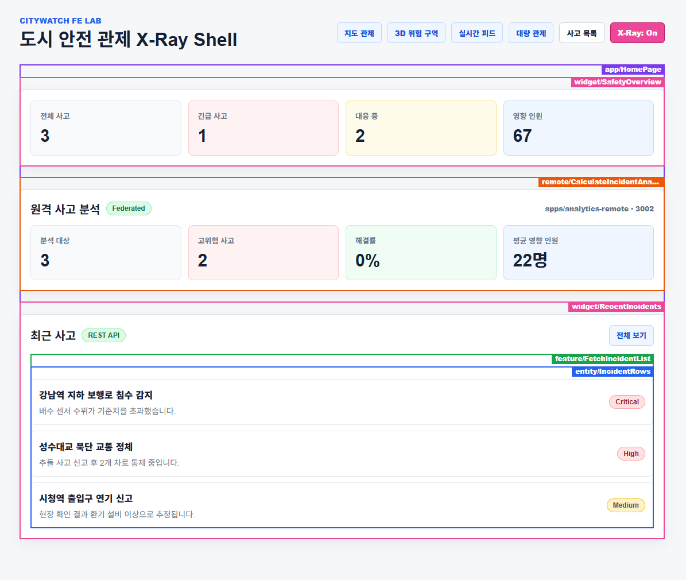
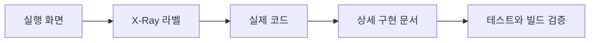

# CityWatch FE Lab

## X-Ray로 프론트엔드 구현 능력을 증명하는 사이드 프로젝트

CityWatch FE Lab은 도시 안전 관제 서비스를 만드는 것이 목적이 아닙니다.

도시 안전 관제라는 도메인은 여러 프론트엔드 기술을 한 화면 흐름 안에 묶기 위한 예시 주제입니다. 이 저장소의 목적은 기술명을 나열하는 것이 아니라, 구현한 기능을 **실행 화면, X-Ray 라벨, 실제 코드, 상세 문서**로 이어서 증명하는 것입니다.

핵심 장치는 **X-Ray**입니다. 화면 위에 `FSD-style` UI 경계와 `remote` 실행 경계를 표시해서, 보는 사람이 “이 UI가 어떤 기술과 코드로 만들어졌는지”를 화면에서 먼저 확인하고 코드와 문서로 바로 따라갈 수 있게 합니다.



## 이 프로젝트를 보는 흐름



루트 README는 프로젝트의 의의와 실행 방법만 안내합니다. 구현을 어떻게 했고 왜 그렇게 했는지는 `docs/` 문서에서 확인합니다.

## 실행 방법

저장소 루트에서 실행합니다.

```bash
npm install
npm run dev
```

`npm run dev`는 프로젝트를 확인하는 데 필요한 세 서비스를 한 번에 실행합니다.

| 서비스 | 역할 | 주소 |
| --- | --- | --- |
| `@citywatch/web` | Next.js App Router shell | `http://127.0.0.1:3000` |
| `@citywatch/analytics-remote` | Module Federation remote | `http://127.0.0.1:3002` |
| `@citywatch/realtime-server` | WebSocket/Polling realtime server | `http://127.0.0.1:3001` |

브라우저에서 아래 주소로 들어갑니다.

```txt
http://127.0.0.1:3000/
```

홈 화면 우측 상단의 X-Ray selector에서 `전체`, `FSD-style`, `Module Federation` 관점을 선택해 구현 경계를 확인합니다.

## 주요 문서

처음 보는 사람은 아래 순서로 보면 됩니다.

| 목적 | 문서 |
| --- | --- |
| 프로젝트가 어떤 기술을 증명하는지 | [docs/tech-proof-points.md](docs/tech-proof-points.md) |
| X-Ray selector를 왜 만들었고 어떻게 동작하는지 | [docs/16-xray-selector.md](docs/16-xray-selector.md) |
| Module Federation만 골라 보는 필터 구현 | [docs/17-module-federation-xray-filter.md](docs/17-module-federation-xray-filter.md) |
| analytics remote와 Module Federation 구현 | [docs/15-analytics-remote-module-federation.md](docs/15-analytics-remote-module-federation.md) |
| realtime server를 왜 분리했는지 | [docs/14-realtime-server-separation.md](docs/14-realtime-server-separation.md) |
| Storybook을 어떻게 구현하고 보는지 | [docs/13-storybook-ui-proof.md](docs/13-storybook-ui-proof.md) |
| 전체 아키텍처 요약 | [docs/00-current-architecture-summary.md](docs/00-current-architecture-summary.md) |

## 실제 코드 입구

| 보고 싶은 것 | 코드 |
| --- | --- |
| X-Ray selector | [apps/web/app/xray-selector.tsx](apps/web/app/xray-selector.tsx) |
| X-Ray 라벨 컴포넌트 | [packages/ui/src/xray.tsx](packages/ui/src/xray.tsx) |
| FSD-style 화면 조립부 | [apps/web/app/shell.tsx](apps/web/app/shell.tsx) |
| Module Federation 사용부 | [apps/web/app/analytics-remote-panel.tsx](apps/web/app/analytics-remote-panel.tsx) |
| Module Federation remote | [apps/analytics-remote/src/incident-analytics.ts](apps/analytics-remote/src/incident-analytics.ts) |
| 통합 개발 서버 실행 | [scripts/dev.mjs](scripts/dev.mjs) |

## 프로젝트 한 줄 정의

CityWatch FE Lab은 도시 안전 관제 화면을 예시 도메인으로 사용해, 프론트엔드 기술 학습 결과를 X-Ray로 추적 가능하게 보여주는 구현 증명형 사이드 프로젝트입니다.
