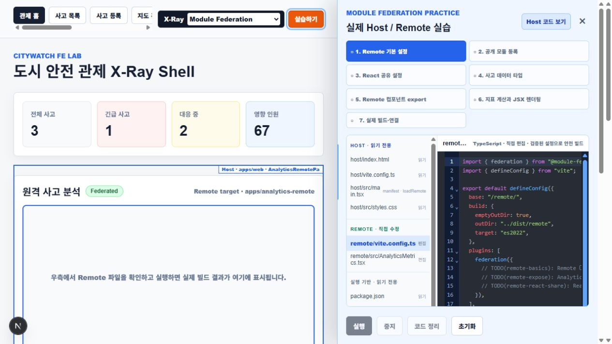
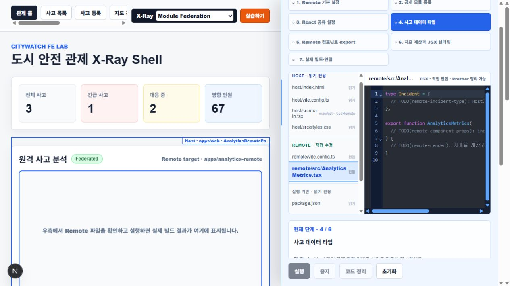
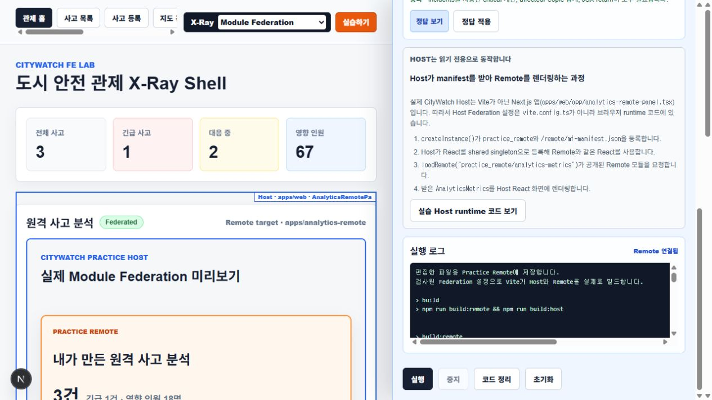
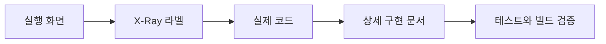
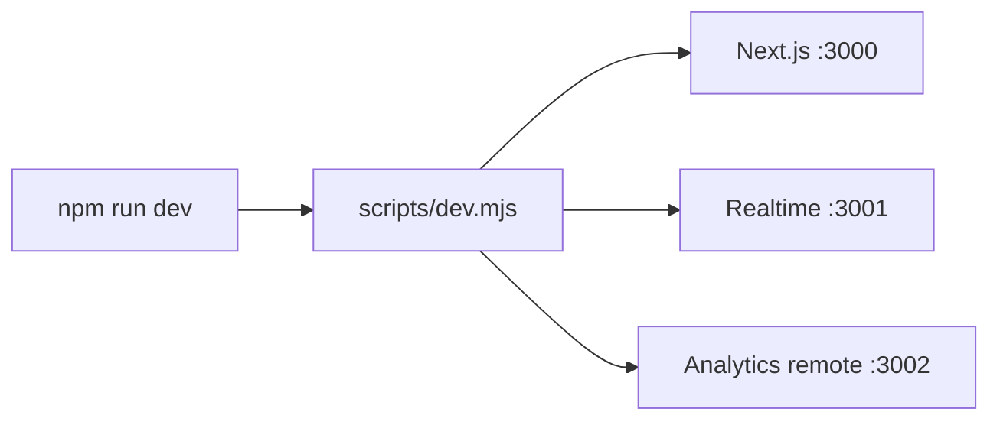

# CityWatch FE Lab (url: https://citywatch-web.vercel.app/?xray=all)

## X-Ray와 실행형 실습으로 프론트엔드 설계를 증명하는 프로젝트

CityWatch FE Lab은 도시 안전 관제 서비스를 만드는 것이 목적이 아닙니다.

도시 안전 관제라는 도메인은 여러 프론트엔드 기술을 한 화면 흐름 안에 묶기 위한 예시 주제입니다. 이 저장소의 목적은 기술명을 나열하는 것이 아니라, 구현한 기능을 **실행 화면, X-Ray 라벨, 실제 코드, 상세 문서**로 이어서 증명하는 것입니다.

핵심 장치는 **X-Ray**입니다. 화면 위에 `FSD-style` UI 경계와 `remote` 실행 경계를 표시해서, 보는 사람이 “이 UI가 어떤 기술과 코드로 만들어졌는지”를 화면에서 먼저 확인하고 코드와 문서로 바로 따라갈 수 있게 합니다.


### X-Ray는 기술 스택이 아니라 CityWatch 자체 구현 기능입니다

X-Ray는 npm에서 설치한 외부 라이브러리나 프레임워크가 아닙니다. CityWatch가 학습 결과를 화면에서 설명하기 위해 직접 만든 **구현 증명 기능**입니다.

```txt
화면에서 기술 관점 선택
→ 해당 기술이 실제로 동작하는 UI 경계만 강조
→ 짧은 X-Ray 라벨 확인
→ 실제 코드와 상세 문서로 이동
```

`XRayBox`는 화면 영역에 기술명만 장식하는 컴포넌트가 아닙니다. 현재 UI가 어떤 패키지와 실행 경계를 사용하고 있는지 실제 렌더링 결과 위에서 확인하게 합니다. 따라서 아래 기술 스택 이미지에는 X-Ray를 외부 기술처럼 넣지 않고, 이 섹션에서 별도로 설명합니다.

## 실행으로 확인하는 Module Federation 설계

이 프로젝트에서 `실습하기`는 별도의 예제 화면을 구경하는 기능이 아닙니다. 현재 보고 있는 CityWatch 화면의 오른쪽에서 Remote 코드를 직접 작성하고, 그 코드가 실제 Module Federation 연결을 거쳐 왼쪽 화면에 반영되는 과정을 확인하는 기능입니다.

### 먼저 이렇게 사용합니다

1. 상단 X-Ray selector에서 `Module Federation`을 선택합니다.
2. selector 바로 옆에 나타나는 `실습하기`를 클릭합니다.
3. 오른쪽 파일 트리에서 `remote/vite.config.ts` 또는 `remote/src/AnalyticsMetrics.tsx`를 선택합니다.
4. 단계별 안내에 맞춰 Remote 코드를 작성하고 `실행`을 클릭합니다.
5. 오른쪽 로그에서 build와 manifest 생성을 확인한 뒤, 왼쪽 분석 패널 안의 실습 결과 영역에서 바뀐 Remote UI를 확인합니다.

왼쪽 CityWatch 화면 자체가 수정되는 것은 아닙니다. 운영 화면은 Host 역할을 유지하고, 그 안의 격리된 Practice Host가 사용자가 만든 Remote를 불러와 결과를 보여줍니다.

사용자는 설명만 읽는 대신 다음 질문에 직접 답하며 실습할 수 있습니다.

- Remote는 어떤 파일에서 컴포넌트를 공개하는가?
- Federation 설정의 `name`, `exposes`, `manifest`는 어떤 역할을 하는가?
- Host는 Remote의 주소와 공개 모듈을 어떻게 알아내는가?
- 코드를 바꾼 뒤 실제 화면에는 어떤 변화가 나타나는가?

즉, 다음 개념을 화면과 코드로 동시에 설명할 수 있습니다.

- **Host / Remote 경계**: 운영 Host는 `apps/web`의 Next.js 앱이고, 운영 Remote는 `apps/analytics-remote`의 Vite 앱입니다.
- **Remote 공개 계약**: Remote가 `name`, `exposes`, `manifest`를 통해 어떤 모듈을 공개하는지 보여줍니다.
- **Runtime Federation**: Host가 manifest를 등록한 뒤 `loadRemote("practice_remote/analytics-metrics")`로 Remote 모듈을 가져옵니다.
- **실제 검증 루프**: 코드 수정 → 자동 단계 검사 → Vite build → manifest 기반 로드 → 왼쪽 UI 변경까지 한 번에 확인합니다.
- **운영 경계 보호**: 운영 앱을 재배포하지 않고, 매 실행마다 폐기 가능한 WebContainer 안에서 실습합니다.

이 구조는 Module Federation의 런타임 결합 방식뿐 아니라, 개발자 경험과 실패 격리까지 함께 확인할 수 있도록 설계되었습니다.

### 실습 화면으로 보는 사용 방법

#### 1. 실습 시작



상단 selector에서 `Module Federation`을 선택한 뒤 selector 오른쪽의 `실습하기`를 클릭합니다. 오른쪽 패널이 열리고, 왼쪽 CityWatch 화면은 Host 역할을 유지하면서 그 안의 실습 결과 영역을 보여줍니다.

#### 2. Remote 코드 작성



오른쪽 패널에는 브라우저 안에 생성된 가상 실습 프로젝트의 Host/Remote 파일 트리가 표시됩니다. Host 파일은 읽기 전용으로 제공되어 manifest 등록과 `loadRemote()` 연결을 확인할 수 있습니다. 실제 작성 대상은 `Remote · 직접 수정` 아래의 두 파일이며, 파일을 선택하면 해당 단계에서 어디를 어떻게 작성해야 하는지 안내가 나타납니다.

#### 3. 실행 결과 확인



Remote 코드를 작성한 뒤 `실행`을 누르면 다음 순서가 실행됩니다.

```txt
사용자 Remote TSX
  → WebContainer에 파일 기록
  → 단계 검사
  → 검증된 Vite 설정으로 Remote 빌드
  → Module Federation manifest 생성
  → 실습 Host가 manifest를 runtime 등록
  → loadRemote()로 Remote 컴포넌트 로드
  → 왼쪽 실습 결과 영역의 Remote UI 변경
```

이때 왼쪽 CityWatch 화면은 운영 Host이고, 화면 안의 주황색 카드가 빌드된 실습 Remote입니다. 운영 Host 자체를 바꾸는 것이 아니라, 격리된 Practice Host가 Remote를 불러와 해당 영역만 바꿉니다.

### 운영 Host와 실습 Host는 다르다

운영 화면의 실제 Host는 Vite 앱이 아니라 Next.js 앱입니다.

```txt
운영 Host
└─ apps/web/app/analytics-remote-panel.tsx
   └─ @module-federation/runtime으로 운영 Remote manifest 로드

실습 Host
└─ 브라우저 WebContainer 안의 host/src/main.tsx
   └─ practice_remote/analytics-metrics를 runtime 로드
```

따라서 운영 Host에 `vite.config.ts`를 추가하는 방식이 아니라, 현재 앱 구조에 맞게 Next.js Client Component의 runtime 코드에서 Remote를 등록하고 로드합니다. 실습 패널은 이 구조를 숨기지 않고 Host 코드 보기 기능으로 공개합니다.

### 안전하게 실제 빌드를 실행하는 이유

사용자 코드를 운영 프로세스나 운영 DOM 안에서 실행하지 않습니다.

- 사용자 파일은 브라우저 내부의 WebContainer에만 기록됩니다.
- 빌드는 고정된 의존성과 검증된 실행 설정으로 수행합니다. 사용자가 입력한 임의의 Node/Vite 설정을 운영 서버에서 실행하지 않습니다.
- 결과는 별도 origin의 sandbox iframe에 렌더링합니다.
- 부모 창과 iframe 사이의 메시지는 origin, source, 실행 ID를 함께 검증합니다.
- 실패한 build와 실행 환경은 `초기화` 또는 패널 종료 시 teardown합니다.
- 운영 Host/Remote는 재배포하지 않습니다.

이것은 공개 서비스에서 임의 코드를 무제한 실행해도 안전하다는 의미가 아닙니다. 현재 구현은 교육용 브라우저 샌드박스이며, 다중 사용자 서비스로 확장할 때는 서버 측 컨테이너·CPU/메모리/시간 제한·네트워크 차단·파일시스템 격리가 추가로 필요합니다.

### 실습 단계와 실행 결과

1. 오른쪽 패널의 단계와 파일 트리를 확인합니다. Host 파일에서는 runtime 연결 방식을 읽고, Remote 파일에서는 직접 코드를 작성합니다.
2. 각 단계의 요구사항에 맞게 `remote/vite.config.ts`와 `remote/src/AnalyticsMetrics.tsx`를 수정합니다. 막히면 `정답 보기`에서 해당 단계의 완성 예시와 작성 위치를 확인할 수 있습니다.
3. 자동 검사를 통과한 뒤 `실행`을 클릭합니다.
4. 오른쪽 실행 로그에서 Remote build와 manifest 생성을 확인하고, 왼쪽 실습 결과 영역에서 수정한 Remote UI를 확인합니다.
5. 다른 내용을 다시 실습하려면 `초기화`를 눌러 처음 상태로 돌아갑니다.

실습하기의 핵심은 작성한 코드가 편집기에만 남지 않는다는 점입니다. Remote TSX는 실제 번들에 반영되고, Federation 설정은 단계 검사로 확인됩니다. 검사를 통과하면 앱이 관리하는 안전한 Vite 설정으로 Remote를 빌드하고, 생성된 manifest를 Practice Host가 runtime으로 불러와 화면에 렌더링합니다.

### Monorepo 실습: 패키지 사용이 아니라 workspace 구성부터

`Monorepo`를 선택하면 실습하기 패널의 목적이 달라집니다. 완성된 `packages/ui`를 가져다 쓰는 것이 아니라, 사용자가 가상 프로젝트의 모노레포 설정을 처음부터 채웁니다.

```txt
루트 package.json에 apps/* · packages/* 등록
  → apps/practice-web workspace 등록
  → packages/ui workspace 등록
  → 앱과 패키지 dependency 연결
  → packages/ui Public API export
  → 앱에서 @practice/ui import
  → 실제 npm workspace 설치와 Vite build
  → 왼쪽 실습 화면에 공용 패키지 UI 표시
```

오른쪽 파일 트리에서 수정하는 핵심 파일은 다음과 같습니다.

- `package.json`: 모노레포 루트와 workspace 범위
- `apps/practice-web/package.json`: 앱 workspace와 내부 패키지 의존성
- `packages/ui/package.json`: 공용 패키지 이름과 진입점
- `packages/ui/src/index.ts`: 패키지 Public API
- `apps/practice-web/src/App.tsx`: workspace package 소비 코드

이 실습은 workspace를 구성하는 설정이 실제 설치 단계에서 연결되고, 빌드된 앱 화면까지 이어지는지를 확인합니다. Module Federation의 runtime Remote 연결과 달리, Monorepo는 하나의 저장소 안에서 앱과 패키지를 빌드 의존성으로 연결하는 과정을 다룹니다.

## 이 프로젝트를 보는 흐름


```mermaid
flowchart LR
  A["실행 화면"] --> B["X-Ray 라벨"]
  B --> C["실제 코드"]
  C --> D["상세 구현 문서"]
  D --> E["테스트와 빌드 검증"]
```

루트 README는 프로젝트의 의의와 실행 방법만 안내합니다. 구현을 어떻게 했고 왜 그렇게 했는지는 `docs/` 문서에서 확인합니다.

## 프로젝트 구성 한눈에 보기

이 저장소는 루트 자체가 하나의 앱이 아니라, 실행 앱과 공유 패키지를 묶는 **npm Workspaces 모노레포**입니다.

### 기술 스택 맵


그림에는 실제 기술과 배포 대상만 표시합니다.

- `Monorepo / npm Workspaces` 아이콘 타일: 여러 앱과 패키지를 한 저장소에서 관리하는 프로젝트 구성을 나타냅니다.
- 회색 외곽선 `CITYWATCH MONOREPO · npm Workspaces`: 세 실행·개발 영역이 그 하나의 저장소와 의존성 그래프 안에 있음을 표시합니다.
- 실선 `deploy`: 어떤 기술 묶음이 어느 배포 서비스로 올라가는지 표시합니다.
- 점선 `visit`: 사용자가 Vercel의 Next.js Web에 접속하는 운영 진입점입니다.
- 점선 `load remote`: 배포된 Web이 별도 Vercel Remote를 런타임에 불러옵니다.
- 점선 `WebSocket`: 배포된 Web이 Render의 실시간 서버에 연결됩니다.

### 모노레포 폴더 구조

```txt
CityWatchFELab
├─ apps
│  ├─ web                 # Next.js host, 화면, REST Route Handler
│  ├─ analytics-remote    # Vite Module Federation remote
│  └─ realtime-server     # WebSocket/Polling Node 서버
├─ packages
│  ├─ api-types           # 공유 타입, Zod 검증, 런타임 타입 가드
│  └─ ui                  # 공용 UI와 X-Ray 컴포넌트
├─ docs                   # 단계별 구현 근거와 코드 흐름
├─ scripts/dev.mjs        # 세 개발 프로세스 통합 실행
├─ package.json           # npm Workspaces와 루트 명령
└─ package-lock.json      # 전체 workspace 의존성 잠금
```

### 설정이 연결되는 방식

| 설정 | 실제 역할 |
| --- | --- |
| 루트 `workspaces` | `apps/*`, `packages/*`를 하나의 의존성 그래프로 설치하고 실행합니다. |
| `scripts/dev.mjs` | `web`, `analytics-remote`, `realtime-server`를 각각 독립 프로세스로 실행합니다. |
| `apps/web/next.config.ts` | workspace 소스 변환과 WebContainer iframe을 위한 COOP/COEP 응답 헤더를 설정합니다. |
| `apps/analytics-remote/vite.config.ts` | 분석 모듈을 Module Federation manifest와 remote entry로 공개합니다. |
| `packages/api-types` | Web, Route Handler, remote가 같은 타입·Zod 검증 계약을 사용하게 합니다. |
| `packages/ui` | 앱과 Storybook이 동일한 Badge·X-Ray UI를 사용하게 합니다. |

개발 명령 하나의 실행 흐름은 다음과 같습니다.


```mermaid
flowchart LR
  DEV["npm run dev"] --> SCRIPT["scripts/dev.mjs"]
  SCRIPT --> WEBDEV["Next.js :3000"]
  SCRIPT --> WSDEV["Realtime :3001"]
  SCRIPT --> MFDEV["Analytics remote :3002"]
```

## 실행 방법

저장소 루트에서 실행합니다.

```bash
npm install
npm run dev
```

`npm run dev`는 프로젝트를 확인하는 데 필요한 세 서비스를 한 번에 실행합니다.

| 서비스 | 역할 | 주소 |
| --- | --- | --- |
| `@citywatch/web` | Next.js App Router shell | `http://127.0.0.1:3000` |
| `@citywatch/analytics-remote` | Module Federation remote | `http://127.0.0.1:3002` |
| `@citywatch/realtime-server` | WebSocket/Polling realtime server | `http://127.0.0.1:3001` |

브라우저에서 아래 주소로 들어갑니다.

```txt
http://127.0.0.1:3000/
```

홈 화면 우측 상단의 X-Ray selector에서 `전체`, `FSD-style`, `Module Federation` 관점을 선택해 구현 경계를 확인합니다.

## 주요 문서

처음 보는 사람은 아래 순서로 보면 됩니다.

| 목적 | 문서 |
| --- | --- |
| 프로젝트가 어떤 기술을 증명하는지 | [docs/tech-proof-points.md](docs/tech-proof-points.md) |
| X-Ray selector를 왜 만들었고 어떻게 동작하는지 | [docs/16-xray-selector.md](docs/16-xray-selector.md) |
| Module Federation만 골라 보는 필터 구현 | [docs/17-module-federation-xray-filter.md](docs/17-module-federation-xray-filter.md) |
| analytics remote와 Module Federation 구현 | [docs/15-analytics-remote-module-federation.md](docs/15-analytics-remote-module-federation.md) |
| realtime server를 왜 분리했는지 | [docs/14-realtime-server-separation.md](docs/14-realtime-server-separation.md) |
| Storybook을 어떻게 구현하고 보는지 | [docs/13-storybook-ui-proof.md](docs/13-storybook-ui-proof.md) |
| 전체 아키텍처 요약 | [docs/00-current-architecture-summary.md](docs/00-current-architecture-summary.md) |
| 구현 완료·부분 구현·예정과 현재 한계 | [docs/21-implementation-status-and-limitations.md](docs/21-implementation-status-and-limitations.md) |
| incident 흐름에 정식 FSD를 적용한 방법 | [docs/22-formal-fsd-implementation.md](docs/22-formal-fsd-implementation.md) |
| 사고 상세 SSR과 hydration 구현 | [docs/23-ssr-hydration.md](docs/23-ssr-hydration.md) |

## 실제 코드 입구

| 보고 싶은 것 | 코드 |
| --- | --- |
| X-Ray selector | [apps/web/app/xray-selector.tsx](apps/web/app/xray-selector.tsx) |
| X-Ray 라벨 컴포넌트 | [packages/ui/src/xray.tsx](packages/ui/src/xray.tsx) |
| FSD entity Public API | [apps/web/src/fsd/entities/incident/index.ts](apps/web/src/fsd/entities/incident/index.ts) |
| FSD feature Public API | [apps/web/src/fsd/features/incident-control/index.ts](apps/web/src/fsd/features/incident-control/index.ts) |
| FSD widget Public API | [apps/web/src/fsd/widgets/incident-detail/index.ts](apps/web/src/fsd/widgets/incident-detail/index.ts) |
| SSR Server Component | [apps/web/app/incidents/[id]/page.tsx](apps/web/app/incidents/[id]/page.tsx) |
| 서버 전용 Incident repository | [apps/web/src/fsd/entities/incident/server.ts](apps/web/src/fsd/entities/incident/server.ts) |
| Module Federation 사용부 | [apps/web/app/analytics-remote-panel.tsx](apps/web/app/analytics-remote-panel.tsx) |
| Module Federation remote | [apps/analytics-remote/src/analytics-metrics.tsx](apps/analytics-remote/src/analytics-metrics.tsx) |
| Module Federation 실습 패널 | [apps/web/app/module-federation-practice.tsx](apps/web/app/module-federation-practice.tsx) |
| 실습 파일·단계·검증 계약 | [apps/web/app/module-federation-practice-files.ts](apps/web/app/module-federation-practice-files.ts) |
| 통합 개발 서버 실행 | [scripts/dev.mjs](scripts/dev.mjs) |

## 프로젝트 한 줄 정의

CityWatch FE Lab은 도시 안전 관제 화면을 예시 도메인으로 사용해, 프론트엔드 기술 학습 결과를 X-Ray로 추적 가능하게 보여주는 구현 증명형 사이드 프로젝트입니다.
