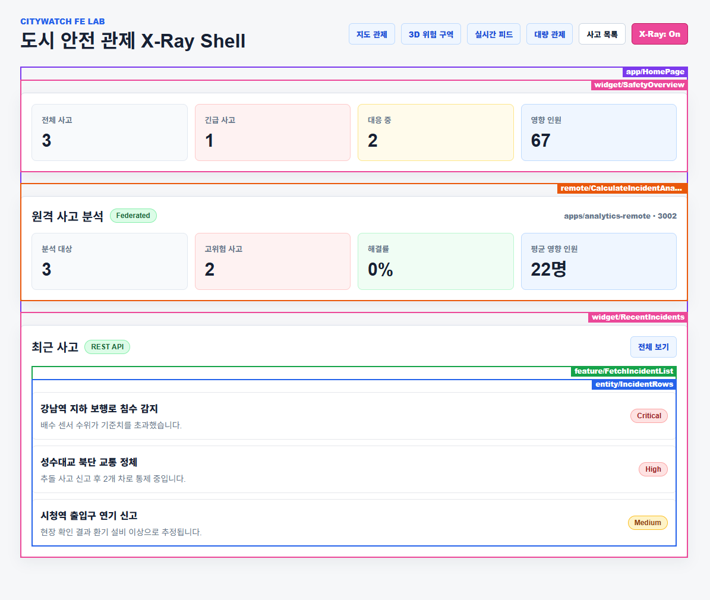
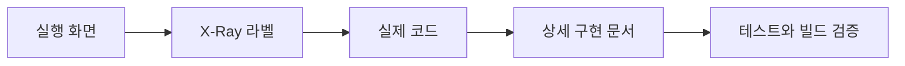
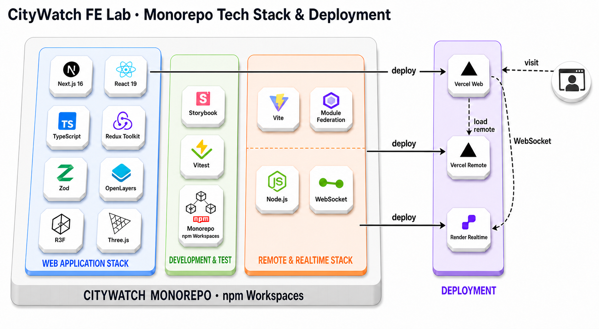
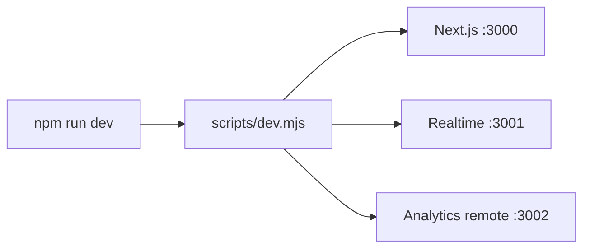

# CityWatch FE Lab

## X-Ray로 프론트엔드 구현 능력을 증명하는 사이드 프로젝트

CityWatch FE Lab은 도시 안전 관제 서비스를 만드는 것이 목적이 아닙니다.

도시 안전 관제라는 도메인은 여러 프론트엔드 기술을 한 화면 흐름 안에 묶기 위한 예시 주제입니다. 이 저장소의 목적은 기술명을 나열하는 것이 아니라, 구현한 기능을 **실행 화면, X-Ray 라벨, 실제 코드, 상세 문서**로 이어서 증명하는 것입니다.

핵심 장치는 **X-Ray**입니다. 화면 위에 `FSD-style` UI 경계와 `remote` 실행 경계를 표시해서, 보는 사람이 “이 UI가 어떤 기술과 코드로 만들어졌는지”를 화면에서 먼저 확인하고 코드와 문서로 바로 따라갈 수 있게 합니다.



### X-Ray는 기술 스택이 아니라 CityWatch 자체 구현 기능입니다

X-Ray는 npm에서 설치한 외부 라이브러리나 프레임워크가 아닙니다. CityWatch가 학습 결과를 화면에서 설명하기 위해 직접 만든 **구현 증명 기능**입니다.

```txt
화면에서 기술 관점 선택
→ 해당 기술이 실제로 동작하는 UI 경계만 강조
→ 짧은 X-Ray 라벨 확인
→ 실제 코드와 상세 문서로 이동
```

`XRayBox`는 화면 영역에 기술명만 장식하는 컴포넌트가 아닙니다. 현재 UI가 어떤 패키지와 실행 경계를 사용하고 있는지 실제 렌더링 결과 위에서 확인하게 합니다. 따라서 아래 기술 스택 이미지에는 X-Ray를 외부 기술처럼 넣지 않고, 이 섹션에서 별도로 설명합니다.

## 이 프로젝트를 보는 흐름


```mermaid
flowchart LR
  A["실행 화면"] --> B["X-Ray 라벨"]
  B --> C["실제 코드"]
  C --> D["상세 구현 문서"]
  D --> E["테스트와 빌드 검증"]
```

루트 README는 프로젝트의 의의와 실행 방법만 안내합니다. 구현을 어떻게 했고 왜 그렇게 했는지는 `docs/` 문서에서 확인합니다.

## 프로젝트 구성 한눈에 보기

이 저장소는 루트 자체가 하나의 앱이 아니라, 실행 앱과 공유 패키지를 묶는 **npm Workspaces 모노레포**입니다.

### 기술 스택 맵



그림에는 실제 기술과 배포 대상만 표시합니다.

- `Monorepo / npm Workspaces` 아이콘 타일: 여러 앱과 패키지를 한 저장소에서 관리하는 프로젝트 구성을 나타냅니다.
- 회색 외곽선 `CITYWATCH MONOREPO · npm Workspaces`: 세 실행·개발 영역이 그 하나의 저장소와 의존성 그래프 안에 있음을 표시합니다.
- 실선 `deploy`: 어떤 기술 묶음이 어느 배포 서비스로 올라가는지 표시합니다.
- 점선 `visit`: 사용자가 Vercel의 Next.js Web에 접속하는 운영 진입점입니다.
- 점선 `load remote`: 배포된 Web이 별도 Vercel Remote를 런타임에 불러옵니다.
- 점선 `WebSocket`: 배포된 Web이 Render의 실시간 서버에 연결됩니다.

### 모노레포 폴더 구조

```txt
CityWatchFELab
├─ apps
│  ├─ web                 # Next.js host, 화면, REST Route Handler
│  ├─ analytics-remote    # Vite Module Federation remote
│  └─ realtime-server     # WebSocket/Polling Node 서버
├─ packages
│  ├─ api-types           # 공유 타입, Zod 검증, 런타임 타입 가드
│  └─ ui                  # 공용 UI와 X-Ray 컴포넌트
├─ docs                   # 단계별 구현 근거와 코드 흐름
├─ scripts/dev.mjs        # 세 개발 프로세스 통합 실행
├─ package.json           # npm Workspaces와 루트 명령
└─ package-lock.json      # 전체 workspace 의존성 잠금
```

### 설정이 연결되는 방식

| 설정 | 실제 역할 |
| --- | --- |
| 루트 `workspaces` | `apps/*`, `packages/*`를 하나의 의존성 그래프로 설치하고 실행합니다. |
| `scripts/dev.mjs` | `web`, `analytics-remote`, `realtime-server`를 각각 독립 프로세스로 실행합니다. |
| `apps/web/next.config.ts` | `@citywatch/api-types`, `@citywatch/ui` workspace 소스를 Next.js가 변환하도록 연결합니다. |
| `apps/analytics-remote/vite.config.ts` | 분석 모듈을 Module Federation manifest와 remote entry로 공개합니다. |
| `packages/api-types` | Web, Route Handler, remote가 같은 타입·Zod 검증 계약을 사용하게 합니다. |
| `packages/ui` | 앱과 Storybook이 동일한 Badge·X-Ray UI를 사용하게 합니다. |

개발 명령 하나의 실행 흐름은 다음과 같습니다.


```mermaid
flowchart LR
  DEV["npm run dev"] --> SCRIPT["scripts/dev.mjs"]
  SCRIPT --> WEBDEV["Next.js :3000"]
  SCRIPT --> WSDEV["Realtime :3001"]
  SCRIPT --> MFDEV["Analytics remote :3002"]
```

## 실행 방법

저장소 루트에서 실행합니다.

```bash
npm install
npm run dev
```

`npm run dev`는 프로젝트를 확인하는 데 필요한 세 서비스를 한 번에 실행합니다.

| 서비스 | 역할 | 주소 |
| --- | --- | --- |
| `@citywatch/web` | Next.js App Router shell | `http://127.0.0.1:3000` |
| `@citywatch/analytics-remote` | Module Federation remote | `http://127.0.0.1:3002` |
| `@citywatch/realtime-server` | WebSocket/Polling realtime server | `http://127.0.0.1:3001` |

브라우저에서 아래 주소로 들어갑니다.

```txt
http://127.0.0.1:3000/
```

홈 화면 우측 상단의 X-Ray selector에서 `전체`, `FSD-style`, `Module Federation` 관점을 선택해 구현 경계를 확인합니다.

## 주요 문서

처음 보는 사람은 아래 순서로 보면 됩니다.

| 목적 | 문서 |
| --- | --- |
| 프로젝트가 어떤 기술을 증명하는지 | [docs/tech-proof-points.md](docs/tech-proof-points.md) |
| X-Ray selector를 왜 만들었고 어떻게 동작하는지 | [docs/16-xray-selector.md](docs/16-xray-selector.md) |
| Module Federation만 골라 보는 필터 구현 | [docs/17-module-federation-xray-filter.md](docs/17-module-federation-xray-filter.md) |
| analytics remote와 Module Federation 구현 | [docs/15-analytics-remote-module-federation.md](docs/15-analytics-remote-module-federation.md) |
| realtime server를 왜 분리했는지 | [docs/14-realtime-server-separation.md](docs/14-realtime-server-separation.md) |
| Storybook을 어떻게 구현하고 보는지 | [docs/13-storybook-ui-proof.md](docs/13-storybook-ui-proof.md) |
| 전체 아키텍처 요약 | [docs/00-current-architecture-summary.md](docs/00-current-architecture-summary.md) |
| 구현 완료·부분 구현·예정과 현재 한계 | [docs/21-implementation-status-and-limitations.md](docs/21-implementation-status-and-limitations.md) |
| incident 흐름에 정식 FSD를 적용한 방법 | [docs/22-formal-fsd-implementation.md](docs/22-formal-fsd-implementation.md) |
| 사고 상세 SSR과 hydration 구현 | [docs/23-ssr-hydration.md](docs/23-ssr-hydration.md) |

## 실제 코드 입구

| 보고 싶은 것 | 코드 |
| --- | --- |
| X-Ray selector | [apps/web/app/xray-selector.tsx](apps/web/app/xray-selector.tsx) |
| X-Ray 라벨 컴포넌트 | [packages/ui/src/xray.tsx](packages/ui/src/xray.tsx) |
| FSD entity Public API | [apps/web/src/fsd/entities/incident/index.ts](apps/web/src/fsd/entities/incident/index.ts) |
| FSD feature Public API | [apps/web/src/fsd/features/incident-control/index.ts](apps/web/src/fsd/features/incident-control/index.ts) |
| FSD widget Public API | [apps/web/src/fsd/widgets/incident-detail/index.ts](apps/web/src/fsd/widgets/incident-detail/index.ts) |
| SSR Server Component | [apps/web/app/incidents/[id]/page.tsx](apps/web/app/incidents/[id]/page.tsx) |
| 서버 전용 Incident repository | [apps/web/src/fsd/entities/incident/server.ts](apps/web/src/fsd/entities/incident/server.ts) |
| Module Federation 사용부 | [apps/web/app/analytics-remote-panel.tsx](apps/web/app/analytics-remote-panel.tsx) |
| Module Federation remote | [apps/analytics-remote/src/incident-analytics.ts](apps/analytics-remote/src/incident-analytics.ts) |
| 통합 개발 서버 실행 | [scripts/dev.mjs](scripts/dev.mjs) |

## 프로젝트 한 줄 정의

CityWatch FE Lab은 도시 안전 관제 화면을 예시 도메인으로 사용해, 프론트엔드 기술 학습 결과를 X-Ray로 추적 가능하게 보여주는 구현 증명형 사이드 프로젝트입니다.
