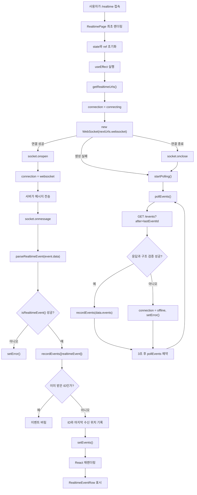

# 10단계 WebSocket/Polling 구현 설명서

이 코드는 `/realtime` 화면에서 실시간 사고 이벤트를 WebSocket으로 먼저 받고, WebSocket이 닫히거나 실패하면 HTTP polling으로 계속 받도록 만드는 기능을 구현한다.

## 분석 기준

폐하가 별도의 코드 블록을 아래에 추가하지 않았기 때문에, 이 설명서는 현재 저장소의 10단계 구현 파일을 기준으로 작성한다.

```txt
apps/web/app/realtime/page.tsx
apps/realtime-server/src/server.mjs
apps/realtime-server/src/websocket-frame.mjs
packages/api-types/src/index.ts
apps/realtime-server/src/websocket-frame.test.mjs
```

## 사실, 의도, 미확정 내용

### 코드에서 확실히 확인되는 내용

```txt
1. 브라우저 페이지는 /realtime 이다.
2. RealtimePage는 처음에 WebSocket으로 ws://{host}:3001/ws에 연결한다.
3. WebSocket 메시지는 parseRealtimeEvent에서 JSON.parse 후 isRealtimeEvent로 검증한다.
4. WebSocket이 close 되면 startPolling이 호출되어 /events?after={lastEventId} polling으로 전환한다.
5. polling 응답은 isRealtimeEventListResponse로 검증한다.
6. recordEvents는 이미 받은 event.id를 seenEventIdsRef로 걸러 중복 표시를 막는다.
7. realtime-server는 /health, /events, /ws를 제공한다.
8. 서버는 4초마다 heartbeat 또는 incident.statusChanged 메시지를 만든다.
9. 서버는 최근 50개 이벤트만 events 배열에 보관한다.
10. WebSocket text frame 생성과 handshake accept 값은 websocket-frame.mjs에서 처리한다.
```

### 코드 구조상 추정되는 구현 의도

```txt
1. WebSocket을 기본 경로로 쓰고 polling은 장애 대응 fallback으로 보여주려는 의도다.
2. 새 ws 패키지를 추가하지 않고 Node 표준 모듈만으로 학습용 최소 서버를 만들려는 의도다.
3. /realtime 화면의 X-RayBox는 "이 UI가 어떤 기술을 증명하는지" 보여주려는 의도다.
4. RealtimeEvent와 RealtimeEventListResponse를 packages/api-types에 둔 것은 서버와 웹 화면이 같은 실시간 계약을 공유하게 하려는 의도다.
```

### 코드만으로는 확정할 수 없는 내용

```txt
1. 실제 운영 배포에서 이 realtime-server를 그대로 쓸지는 확정할 수 없다.
2. 실제 공공 API나 DB에서 사고 이벤트를 받아오는지는 현재 코드만으로 확인되지 않는다.
3. 인증, 권한, 사용자별 구독 범위는 현재 코드에 없다.
4. 서버 재시작 후 이벤트 ID가 초기화될 때 클라이언트가 어떻게 복구해야 하는지는 현재 코드에 없다.
```

## 문제 또는 구현 목적

기존 화면은 REST API로 사고 데이터를 가져왔다.

REST API는 사용자가 화면을 열거나 다시 요청할 때 데이터를 가져오는 방식이다. 그래서 "서버에서 새 사고 상태 변경이 생겼다"는 상황을 화면이 자동으로 즉시 알기 어렵다.

10단계의 목적은 이것이다.

```txt
관제 화면을 켠 상태에서
→ 서버가 실시간 이벤트를 만들고
→ 브라우저가 그 이벤트를 받고
→ 화면에 이벤트 목록, 연결 상태, fallback 상태를 보여준다.
```

## 기존 방식으로는 부족한 이유

기존 REST 흐름은 이런 식이다.

```txt
사용자 접속
→ fetchIncidents()
→ GET /api/incidents
→ 한 번 받은 사고 목록 표시
```

이 방식만 있으면, 서버에서 4초 뒤에 `INC-002` 상태가 `dispatching`으로 바뀌어도 브라우저는 모른다. 브라우저가 다시 요청해야만 알 수 있다.

실시간 관제 화면에서는 사용자가 새로고침하지 않아도 바뀐 이벤트가 들어와야 한다. 그래서 WebSocket이 필요하다. WebSocket은 한 번 연결한 뒤 서버가 브라우저 쪽으로 먼저 메시지를 보낼 수 있는 연결이다.

하지만 WebSocket만 있으면 또 문제가 있다.

```txt
방화벽, 프록시, 서버 재시작, 네트워크 끊김
→ WebSocket 연결 종료
→ 화면이 더 이상 이벤트를 못 받음
```

그래서 fallback이 필요하다. fallback은 기본 방식이 실패했을 때 대신 쓰는 예비 방식이다. 이 코드에서는 fallback으로 HTTP polling을 쓴다.

## 해결하기 위해 필요한 조건

이 기능이 안정적으로 돌아가려면 조건이 네 가지 필요하다.

```txt
1. 서버는 WebSocket endpoint를 제공해야 한다.
2. 서버는 WebSocket이 안 될 때 쓸 polling endpoint도 제공해야 한다.
3. 클라이언트는 받은 JSON이 진짜 RealtimeEvent인지 검증해야 한다.
4. 클라이언트는 같은 이벤트를 WebSocket과 polling에서 중복 표시하지 않아야 한다.
```

이 조건이 코드에서는 이렇게 연결된다.

```txt
WebSocket endpoint
→ apps/realtime-server/src/server.mjs 의 server.on("upgrade")

Polling endpoint
→ apps/realtime-server/src/server.mjs 의 if (url.pathname === "/events")

Runtime validation
→ packages/api-types/src/index.ts 의 isRealtimeEvent, isRealtimeEventListResponse

Duplicate guard
→ apps/web/app/realtime/page.tsx 의 seenEventIdsRef, recordEvents
```

## 선택한 구현 방식

선택한 구조는 간단하다.

```txt
브라우저 /realtime
→ WebSocket 먼저 연결
→ 메시지를 받으면 검증 후 events state에 추가
→ WebSocket이 닫히면 polling 시작
→ polling 응답도 검증 후 events state에 추가
```

서버는 새 라이브러리 없이 Node 표준 기능으로 구현되어 있다.

```ts
import { createServer } from "node:http";
import { encodeWebSocketText, getWebSocketAccept } from "./websocket-frame.mjs";
```

이 선택의 의미는 "운영급 WebSocket 프레임워크"를 만든 것이 아니라, FE 학습 앱에서 WebSocket lifecycle과 fallback 흐름을 화면으로 증명하는 데 필요한 최소 구현을 만든 것이다.

## 사용자 행동에서 최종 결과까지 전체 흐름

### 정상 WebSocket 흐름

사용자가 하는 행동은 하나다.

```txt
사용자 행동
→ http://127.0.0.1:3000/realtime 접속
```

그 뒤 실제 코드 흐름은 이렇게 이어진다.

```txt
사용자 행동
→ /realtime 라우트 진입
→ RealtimePage 렌더링
→ useEffect 실행
→ getRealtimeUrls() 호출
→ nextUrls.websocket = "ws://127.0.0.1:3001/ws"
→ new WebSocket(nextUrls.websocket)
→ 서버 server.on("upgrade") 실행
→ getWebSocketAccept(key)로 handshake 응답 생성
→ clients.add(socket)
→ sendEvent(socket, appendEvent({ type: "heartbeat", sentAt: now() }))
→ 브라우저 socket.onmessage 실행
→ parseRealtimeEvent(event.data)
→ isRealtimeEvent(data) 통과
→ recordEvents([realtimeEvent])
→ seenEventIdsRef.current에 event.id 저장
→ lastEventIdRef.current 갱신
→ setEvents(...) 호출
→ RealtimeEventRow 렌더링
→ 화면 이벤트 스트림에 heartbeat 표시
```

### WebSocket 실패 후 polling fallback 흐름

WebSocket이 닫히면 흐름이 바뀐다.

```txt
WebSocket close 발생
→ socket.onclose 실행
→ disposed가 false인지 확인
→ startPolling("WebSocket 연결이 닫혀 polling fallback으로 전환했습니다.")
→ setConnection({ mode: "polling", detail })
→ pollEvents()
→ fetch(`${nextUrls.polling}?after=${lastEventIdRef.current}`)
→ 서버 /events 실행
→ events.filter((event) => event.id > after)
→ 브라우저 response.json()
→ isRealtimeEventListResponse(data)
→ recordEvents(data.events)
→ setEvents(...)
→ 화면에 Polling 배지와 새 이벤트 표시
```

## 실제 값으로 처음부터 끝까지 추적

예시 상황을 하나 만들자.

```txt
현재 브라우저 상태
events = []
lastEventIdRef.current = 0
seenEventIdsRef.current = Set()
connection = { mode: "connecting", detail: "실시간 서버 연결을 준비합니다." }
```

사용자가 `/realtime`에 접속하면 `useEffect`가 실행된다.

```ts
const nextUrls = getRealtimeUrls();

setUrls(nextUrls);
setConnection({
  detail: "WebSocket 연결을 시도합니다.",
  mode: "connecting",
});
```

이때 만들어지는 값은 다음과 같다.

```txt
nextUrls = {
  websocket: "ws://127.0.0.1:3001/ws",
  polling: "http://127.0.0.1:3001/events"
}

connection = {
  mode: "connecting",
  detail: "WebSocket 연결을 시도합니다."
}
```

서버가 WebSocket 연결을 받으면 즉시 heartbeat를 보낸다.

```ts
sendEvent(socket, appendEvent({ sentAt: now(), type: "heartbeat" }));
```

예를 들어 서버 내부 값이 이렇게 바뀐다.

```txt
실행 전
nextEventId = 0
events = []

appendEvent({ sentAt: "2026-07-11T09:33:24.284Z", type: "heartbeat" })

중간 계산
event = {
  id: 1,
  message: {
    type: "heartbeat",
    sentAt: "2026-07-11T09:33:24.284Z"
  }
}

실행 후
nextEventId = 1
events = [
  {
    id: 1,
    message: {
      type: "heartbeat",
      sentAt: "2026-07-11T09:33:24.284Z"
    }
  }
]
```

그 이벤트는 `sendEvent`에서 JSON 문자열로 바뀐다.

```ts
socket.write(encodeWebSocketText(JSON.stringify(event)));
```

브라우저에는 이런 문자열이 들어온다.

```json
{"id":1,"message":{"sentAt":"2026-07-11T09:33:24.284Z","type":"heartbeat"}}
```

브라우저의 `socket.onmessage`가 실행된다.

```ts
socket.onmessage = (event) => {
  const realtimeEvent = parseRealtimeEvent(event.data);
  if (!realtimeEvent) {
    setError("WebSocket message shape is invalid.");
    return;
  }

  recordEvents([realtimeEvent]);
};
```

값은 이렇게 흐른다.

```txt
event.data
→ '{"id":1,"message":{"sentAt":"2026-07-11T09:33:24.284Z","type":"heartbeat"}}'

parseRealtimeEvent(event.data)
→ JSON.parse
→ isRealtimeEvent(data)
→ true

realtimeEvent
→ {
    id: 1,
    message: {
      type: "heartbeat",
      sentAt: "2026-07-11T09:33:24.284Z"
    }
  }
```

그 다음 `recordEvents`가 실행된다.

```ts
function recordEvents(nextEvents: RealtimeEvent[]) {
  const uniqueEvents = nextEvents.filter((event) => {
    if (seenEventIdsRef.current.has(event.id)) return false;
    seenEventIdsRef.current.add(event.id);
    lastEventIdRef.current = Math.max(lastEventIdRef.current, event.id);
    return true;
  });

  if (uniqueEvents.length === 0) return;

  setEvents((current) =>
    [...uniqueEvents.sort((a, b) => b.id - a.id), ...current].slice(
      0,
      maxVisibleEvents,
    ),
  );
}
```

실제 값 변화는 다음과 같다.

```txt
실행 전
nextEvents = [{ id: 1, message: { type: "heartbeat", sentAt: "..." } }]
seenEventIdsRef.current = Set()
lastEventIdRef.current = 0
events = []

filter 첫 번째 event 검사
seenEventIdsRef.current.has(1)
→ false

seenEventIdsRef.current.add(1)
→ Set(1)

lastEventIdRef.current = Math.max(0, 1)
→ 1

uniqueEvents
→ [{ id: 1, message: { type: "heartbeat", sentAt: "..." } }]

setEvents 실행
current = []
[...uniqueEvents, ...current].slice(0, 12)
→ [{ id: 1, message: { type: "heartbeat", sentAt: "..." } }]

실행 후
events = [{ id: 1, message: { type: "heartbeat", sentAt: "..." } }]
lastEventIdRef.current = 1
seenEventIdsRef.current = Set(1)
```

이제 JSX에서 `events.length`가 1이므로 빈 상태 문구가 사라지고 목록이 나온다.

```tsx
{events.length === 0 ? (
  <p className="state-message" role="status">
    수신된 이벤트가 아직 없습니다. realtime 서버가 켜져 있으면 곧 heartbeat가 표시됩니다.
  </p>
) : (
  <ol className="realtime-event-list" aria-live="polite">
    {events.map((event) => (
      <RealtimeEventRow event={event} key={event.id} />
    ))}
  </ol>
)}
```

최종 화면에는 이런 결과가 남는다.

```txt
연결 모드: WebSocket
수신 이벤트: 1
마지막 ID: 1
이벤트 스트림:
  서버 heartbeat 수신
  heartbeat
```

## 코드 묶음별 설명

### 1. 공유 타입과 runtime validation

관련 코드:

```ts
export type RealtimeEvent = {
  id: number;
  message: RealtimeMessage;
};

export type RealtimeEventListResponse = {
  events: RealtimeEvent[];
  serverTime: ISODateTime;
};

export function isRealtimeEvent(value: unknown): value is RealtimeEvent {
  return isRecord(value) && typeof value.id === "number" && value.id > 0 && isRealtimeMessage(value.message);
}
```

1. 이 코드가 실행되기 전 값이나 상태

서버에서 들어온 값은 TypeScript 입장에서 `unknown`이다. JSON은 외부에서 온 문자열이기 때문에, TypeScript 타입 선언만으로 안전하다고 볼 수 없다.

```txt
data = JSON.parse(event.data)
```

2. 이 시점에 해결해야 하는 문제

브라우저가 받은 값이 진짜 `RealtimeEvent`인지 확인해야 한다.

3. 이 코드가 필요한 이유

`message.status`가 `"unknown"`인데도 화면에서 `incidentStatusLabels[message.status]`를 실행하면 undefined가 나온다. 더 복잡한 코드에서는 런타임 오류로 이어진다.

4. 입력되는 값

예시 입력:

```ts
{
  id: 2,
  message: {
    type: "incident.statusChanged",
    incidentId: "INC-002",
    status: "dispatching",
    sentAt: "2026-07-11T09:33:28.000Z"
  }
}
```

5. 내부에서 값이 바뀌는 과정

`isRealtimeEvent`는 먼저 객체인지 확인하고, `id`가 양수 number인지 확인하고, `message`는 `isRealtimeMessage`에 넘긴다.

```ts
export function isRealtimeMessage(value: unknown): value is RealtimeMessage {
  if (!isRecord(value) || typeof value.type !== "string" || typeof value.sentAt !== "string") return false;
  if (value.type === "heartbeat") return true;

  if (value.type === "incident.statusChanged") {
    return typeof value.incidentId === "string" && typeof value.status === "string" && isIncidentStatus(value.status);
  }

  if (value.type === "incident.created" || value.type === "incident.updated") {
    return isIncident(value.incident);
  }

  return false;
}
```

여기서 `status`는 `isIncidentStatus(value.status)`를 통과해야 한다.

```txt
value.status = "dispatching"
→ incidentStatuses에 포함됨
→ true
```

6. 실행 후 남는 값

검증을 통과하면 TypeScript는 그 값을 `RealtimeEvent`로 좁혀서 본다.

```txt
unknown
→ RealtimeEvent
```

7. 그 값이 다음 코드에서 사용되는 방식

`parseRealtimeEvent`가 검증된 값을 반환하고, `recordEvents([realtimeEvent])`가 그 값을 화면 상태에 넣는다.

```ts
const realtimeEvent = parseRealtimeEvent(event.data);
if (!realtimeEvent) {
  setError("WebSocket message shape is invalid.");
  return;
}

recordEvents([realtimeEvent]);
```

8. 이 코드를 제거하거나 다르게 작성했을 때 생기는 문제

검증 없이 `JSON.parse(event.data) as RealtimeEvent`로 처리하면 잘못된 서버 응답도 정상 데이터처럼 들어온다.

예를 들어:

```ts
{
  id: 3,
  message: {
    type: "incident.statusChanged",
    incidentId: "INC-003",
    status: "unknown",
    sentAt: "2026-07-11T09:33:32.000Z"
  }
}
```

이 값은 타입 단언만 하면 통과한 것처럼 보인다. 하지만 화면에서 다음 코드가 실행될 때 문제가 생긴다.

```ts
incidentStatusLabels[message.status]
```

실제 계산:

```txt
message.status = "unknown"
incidentStatusLabels["unknown"]
→ undefined
```

결과적으로 화면에 `INC-003 상태 변경: undefined`처럼 잘못된 텍스트가 표시된다.

### 2. 서버 이벤트 저장과 생성

관련 코드:

```js
const clients = new Set();
const events = [];
const maxEvents = 50;
let nextEventId = 0;
let tick = 0;

function appendEvent(message) {
  const event = { id: ++nextEventId, message };
  events.push(event);
  if (events.length > maxEvents) events.shift();
  return event;
}
```

1. 이 코드가 실행되기 전 값이나 상태

서버가 처음 켜지면 값은 이렇게 시작한다.

```txt
clients = Set()
events = []
nextEventId = 0
tick = 0
```

2. 이 시점에 해결해야 하는 문제

WebSocket으로 즉시 보내는 이벤트와 polling으로 나중에 가져갈 이벤트가 같은 기준으로 관리되어야 한다.

3. 이 코드가 필요한 이유

polling은 `after` 값을 기준으로 "내가 마지막으로 본 ID 이후 이벤트만 주세요"라고 요청한다. 그러려면 서버 이벤트마다 증가하는 `id`가 있어야 한다.

4. 입력되는 값

예시 입력:

```js
message = {
  incidentId: "INC-002",
  sentAt: "2026-07-11T09:33:28.000Z",
  status: "dispatching",
  type: "incident.statusChanged"
}
```

5. 내부에서 값이 바뀌는 과정

```txt
nextEventId = 1
appendEvent(message)
→ ++nextEventId
→ 2

event = { id: 2, message }
events.push(event)
```

6. 실행 후 남는 값

```txt
events = [
  { id: 1, message: { type: "heartbeat", sentAt: "..." } },
  { id: 2, message: { type: "incident.statusChanged", incidentId: "INC-002", status: "dispatching", sentAt: "..." } }
]
nextEventId = 2
```

7. 그 값이 다음 코드에서 사용되는 방식

WebSocket 쪽에서는 `broadcast(appendEvent(message))`로 바로 전송한다.

```js
broadcast(appendEvent(message));
```

Polling 쪽에서는 `/events?after=1` 요청이 오면 `id > 1`인 이벤트만 돌려준다.

```js
events: events.filter((event) => event.id > after)
```

8. 이 코드를 제거하거나 다르게 작성했을 때 생기는 문제

이벤트에 증가하는 `id`가 없으면 클라이언트는 어디까지 받았는지 알 수 없다.

예를 들어 polling이 매번 전체 events를 받는다면:

```txt
첫 번째 polling
→ [1, 2, 3]

두 번째 polling
→ [1, 2, 3, 4]
```

클라이언트가 중복 제거를 하지 않으면 1, 2, 3이 다시 화면에 나온다. 중복 제거가 있어도 불필요한 데이터가 계속 커진다.

### 3. 서버 HTTP endpoint

관련 코드:

```js
const server = createServer((request, response) => {
  const url = new URL(request.url ?? "/", `http://${request.headers.host ?? "127.0.0.1"}`);

  if (request.method === "OPTIONS") {
    response.writeHead(204, getCorsHeaders());
    response.end();
    return;
  }

  if (url.pathname === "/health") {
    writeJson(response, 200, {
      clients: clients.size,
      events: events.length,
      ok: true,
      serverTime: now(),
    });
    return;
  }

  if (url.pathname === "/events") {
    const after = Number(url.searchParams.get("after") ?? 0);
    writeJson(response, 200, {
      events: events.filter((event) => event.id > after),
      serverTime: now(),
    });
    return;
  }

  writeJson(response, 404, { error: "NOT_FOUND" });
});
```

1. 이 코드가 실행되기 전 값이나 상태

브라우저에서 polling을 하려면 HTTP 요청이 서버로 들어온다.

```txt
GET http://127.0.0.1:3001/events?after=2
```

2. 이 시점에 해결해야 하는 문제

브라우저가 마지막으로 받은 이벤트 이후의 이벤트만 받아야 한다.

3. 이 코드가 필요한 이유

WebSocket이 끊겼을 때도 화면이 완전히 멈추지 않게 하려면 HTTP로 새 이벤트를 가져올 수 있어야 한다.

4. 입력되는 값

```txt
request.url = "/events?after=2"
url.pathname = "/events"
url.searchParams.get("after") = "2"
```

5. 내부에서 값이 바뀌는 과정

```txt
after = Number("2")
→ 2

events.filter((event) => event.id > 2)
```

현재 서버 events가 이렇다고 하자.

```txt
events = [
  { id: 1, message: heartbeat },
  { id: 2, message: INC-002 dispatching },
  { id: 3, message: INC-003 in_progress },
  { id: 4, message: heartbeat }
]
```

필터 결과:

```txt
id > 2
→ [{ id: 3, ... }, { id: 4, ... }]
```

6. 실행 후 남는 값

응답 JSON:

```json
{
  "events": [
    { "id": 3, "message": { "type": "incident.statusChanged", "incidentId": "INC-003", "status": "in_progress", "sentAt": "..." } },
    { "id": 4, "message": { "type": "heartbeat", "sentAt": "..." } }
  ],
  "serverTime": "2026-07-11T09:33:40.000Z"
}
```

7. 그 값이 다음 코드에서 사용되는 방식

브라우저의 `pollEvents`가 이 JSON을 받아 검증한다.

```ts
const data = await response.json();
if (!isRealtimeEventListResponse(data)) {
  throw new Error("Polling response shape is invalid.");
}

recordEvents(data.events);
```

8. 이 코드를 제거하거나 다르게 작성했을 때 생기는 문제

`after` 없이 항상 전체 이벤트를 보내면 polling이 오래 켜질수록 응답이 커진다. 지금은 서버도 `maxEvents = 50`으로 제한하지만, 그래도 매번 같은 50개를 보내는 것은 낭비다.

### 4. WebSocket handshake와 frame 전송

관련 코드:

```js
server.on("upgrade", (request, socket) => {
  const url = new URL(request.url ?? "/", `http://${request.headers.host ?? "127.0.0.1"}`);
  const key = request.headers["sec-websocket-key"];

  if (url.pathname !== "/ws" || typeof key !== "string") {
    socket.destroy();
    return;
  }

  socket.write(
    [
      "HTTP/1.1 101 Switching Protocols",
      "Upgrade: websocket",
      "Connection: Upgrade",
      `Sec-WebSocket-Accept: ${getWebSocketAccept(key)}`,
      "",
      "",
    ].join("\r\n"),
  );

  clients.add(socket);
  socket.on("close", () => clients.delete(socket));
  socket.on("error", () => clients.delete(socket));
  socket.on("data", (chunk) => {
    if ((chunk[0] & 0x0f) === 0x08) {
      socket.write(Buffer.from([0x88, 0x00]));
      socket.end();
    }
  });

  sendEvent(socket, appendEvent({ sentAt: now(), type: "heartbeat" }));
});
```

1. 이 코드가 실행되기 전 값이나 상태

브라우저가 `new WebSocket("ws://127.0.0.1:3001/ws")`를 실행하면 HTTP upgrade 요청이 서버에 도착한다.

2. 이 시점에 해결해야 하는 문제

일반 HTTP 연결을 WebSocket 연결로 바꿔야 한다. 이것을 handshake라고 한다. handshake는 서로 "이제부터 WebSocket 방식으로 말하자"라고 합의하는 과정이다.

3. 이 코드가 필요한 이유

Node의 기본 `http` 서버는 자동으로 WebSocket 서버가 되지 않는다. 그래서 `upgrade` 이벤트에서 직접 WebSocket 응답 헤더를 써야 한다.

4. 입력되는 값

예시:

```txt
url.pathname = "/ws"
key = "dGhlIHNhbXBsZSBub25jZQ=="
```

5. 내부에서 값이 바뀌는 과정

`getWebSocketAccept(key)`가 실행된다.

```js
export function getWebSocketAccept(key) {
  return createHash("sha1").update(`${key}${websocketGuid}`).digest("base64");
}
```

예시 값:

```txt
key = "dGhlIHNhbXBsZSBub25jZQ=="
websocketGuid = "258EAFA5-E914-47DA-95CA-C5AB0DC85B11"

sha1 + base64 결과
→ "s3pPLMBiTxaQ9kYGzzhZRbK+xOo="
```

이 값은 테스트에서도 확인한다.

```js
assert.equal(
  getWebSocketAccept("dGhlIHNhbXBsZSBub25jZQ=="),
  "s3pPLMBiTxaQ9kYGzzhZRbK+xOo=",
);
```

6. 실행 후 남는 값

브라우저와 서버 사이에 WebSocket 연결이 열린다.

```txt
clients = Set(socket)
```

7. 그 값이 다음 코드에서 사용되는 방식

서버는 이 socket으로 첫 heartbeat 이벤트를 보낸다.

```js
sendEvent(socket, appendEvent({ sentAt: now(), type: "heartbeat" }));
```

8. 이 코드를 제거하거나 다르게 작성했을 때 생기는 문제

`Sec-WebSocket-Accept` 값이 틀리면 브라우저는 WebSocket 연결을 열지 않는다. 겉으로는 서버가 켜져 있어도 `/realtime` 화면은 WebSocket 이벤트를 못 받고, 결국 polling fallback으로 가게 된다.

### 5. WebSocket text frame 인코딩

관련 코드:

```js
export function encodeWebSocketText(text) {
  const payload = Buffer.from(text);
  const length = payload.length;

  if (length < 126) {
    return Buffer.concat([Buffer.from([0x81, length]), payload]);
  }

  if (length < 65536) {
    const header = Buffer.alloc(4);
    header[0] = 0x81;
    header[1] = 126;
    header.writeUInt16BE(length, 2);
    return Buffer.concat([header, payload]);
  }

  const header = Buffer.alloc(10);
  header[0] = 0x81;
  header[1] = 127;
  header.writeBigUInt64BE(BigInt(length), 2);
  return Buffer.concat([header, payload]);
}
```

1. 이 코드가 실행되기 전 값이나 상태

서버가 보내고 싶은 값은 JSON 문자열이다.

```txt
text = '{"id":1,"message":{"sentAt":"...","type":"heartbeat"}}'
```

2. 이 시점에 해결해야 하는 문제

WebSocket은 그냥 문자열을 TCP socket에 쓰는 방식이 아니다. 브라우저가 읽을 수 있는 WebSocket frame 형식으로 감싸야 한다.

3. 이 코드가 필요한 이유

`socket.write(JSON.stringify(event))`만 하면 브라우저는 그것을 WebSocket 메시지로 해석하지 못한다.

4. 입력되는 값

작은 테스트 입력:

```txt
text = "ok"
payload = Buffer.from("ok")
length = 2
```

5. 내부에서 값이 바뀌는 과정

`length < 126`이므로 첫 번째 분기가 실행된다.

```js
Buffer.concat([Buffer.from([0x81, length]), payload])
```

결과 frame:

```txt
첫 byte 0x81
→ text frame

두 번째 byte 2
→ payload 길이 2

payload "ok"
```

6. 실행 후 남는 값

테스트에서 확인하는 값:

```js
assert.equal(frame[0], 0x81);
assert.equal(frame[1], 2);
assert.equal(frame.subarray(2).toString(), "ok");
```

7. 그 값이 다음 코드에서 사용되는 방식

`sendEvent`가 이 Buffer를 socket에 쓴다.

```js
socket.write(encodeWebSocketText(JSON.stringify(event)));
```

8. 이 코드를 제거하거나 다르게 작성했을 때 생기는 문제

프레임 없이 raw JSON을 쓰면 브라우저의 `socket.onmessage`가 정상 실행되지 않는다. 서버 입장에서는 데이터를 쓴 것처럼 보이지만, WebSocket 프로토콜 형식이 아니므로 클라이언트는 메시지로 받지 못한다.

### 6. RealtimePage의 상태값

관련 코드:

```ts
const [xray, setXray] = useState(true);
const [connection, setConnection] = useState<ConnectionState>({
  detail: "실시간 서버 연결을 준비합니다.",
  mode: "connecting",
});
const [events, setEvents] = useState<RealtimeEvent[]>([]);
const [error, setError] = useState<string>();
const [urls, setUrls] = useState<RealtimeUrls>();
const [connectionRun, setConnectionRun] = useState(0);
const lastEventIdRef = useRef(0);
const seenEventIdsRef = useRef(new Set<number>());
```

1. 이 코드가 실행되기 전 값이나 상태

`/realtime` 페이지 컴포넌트가 처음 렌더링되기 전에는 화면 상태가 없다.

2. 이 시점에 해결해야 하는 문제

화면이 보여줘야 할 값들이 필요하다.

```txt
X-Ray On/Off
현재 연결 모드
수신한 이벤트 목록
오류 메시지
현재 연결 URL
재연결 트리거
마지막으로 받은 이벤트 ID
이미 받은 이벤트 ID 집합
```

3. 이 코드가 필요한 이유

각 값이 화면과 연결 동작에 직접 영향을 준다.

4. 입력되는 값

초기값:

```txt
xray = true
connection = { mode: "connecting", detail: "실시간 서버 연결을 준비합니다." }
events = []
error = undefined
urls = undefined
connectionRun = 0
lastEventIdRef.current = 0
seenEventIdsRef.current = Set()
```

5. 내부에서 값이 바뀌는 과정

예를 들어 WebSocket이 열리면:

```ts
socket.onopen = () => {
  setConnection({
    detail: "WebSocket으로 실시간 이벤트를 수신 중입니다.",
    mode: "websocket",
  });
  setError(undefined);
};
```

값 변화:

```txt
connection.mode = "connecting"
→ "websocket"

connection.detail = "WebSocket으로 실시간 이벤트를 수신 중입니다."
error = undefined
```

6. 실행 후 남는 값

화면 상단 metric이 바뀐다.

```tsx
<RealtimeMetric
  title="연결 모드"
  value={getConnectionLabel(connection.mode)}
  tone={getConnectionTone(connection.mode)}
/>
```

7. 그 값이 다음 코드에서 사용되는 방식

`connection.mode`는 배지 색과 fallback 표시에도 쓰인다.

```tsx
<Badge tone={getConnectionTone(connection.mode)}>
  {getConnectionLabel(connection.mode)}
</Badge>
```

8. 이 코드를 제거하거나 다르게 작성했을 때 생기는 문제

`lastEventIdRef`를 state로 바꾸면 이벤트 하나 받을 때마다 이 값 때문에 렌더링이 더 자주 일어난다. 반대로 `events`를 ref로만 두면 화면이 다시 렌더링되지 않아 목록이 바뀌지 않는다.

현재 구조는 화면에 보여줘야 하는 목록은 state, 요청 기준값과 중복 체크용 값은 ref로 나눈다.

### 7. useEffect 연결 lifecycle

관련 코드:

```ts
useEffect(() => {
  let disposed = false;
  let pollingTimer: ReturnType<typeof setTimeout> | undefined;
  let socket: WebSocket | undefined;
  const nextUrls = getRealtimeUrls();

  setUrls(nextUrls);
  setConnection({
    detail: "WebSocket 연결을 시도합니다.",
    mode: "connecting",
  });

  try {
    socket = new WebSocket(nextUrls.websocket);
  } catch (reason) {
    startPolling(getErrorMessage(reason));
    return () => {
      disposed = true;
      if (pollingTimer) clearTimeout(pollingTimer);
    };
  }

  return () => {
    disposed = true;
    socket?.close();
    if (pollingTimer) clearTimeout(pollingTimer);
  };
}, [connectionRun]);
```

1. 이 코드가 실행되기 전 값이나 상태

컴포넌트가 화면에 나타났고, `connectionRun`은 0이다.

2. 이 시점에 해결해야 하는 문제

실시간 연결을 시작하고, 컴포넌트가 사라질 때 연결과 timer를 정리해야 한다.

3. 이 코드가 필요한 이유

정리(cleanup)를 하지 않으면 페이지를 떠난 뒤에도 WebSocket이나 polling timer가 계속 살아 있을 수 있다.

4. 입력되는 값

```txt
connectionRun = 0
window.location.hostname = "127.0.0.1"
```

5. 내부에서 값이 바뀌는 과정

```txt
nextUrls = getRealtimeUrls()
→ {
    websocket: "ws://127.0.0.1:3001/ws",
    polling: "http://127.0.0.1:3001/events"
  }

setUrls(nextUrls)
setConnection({ mode: "connecting", detail: "WebSocket 연결을 시도합니다." })
socket = new WebSocket(nextUrls.websocket)
```

6. 실행 후 남는 값

브라우저에 WebSocket 객체가 생긴다. 그 객체에는 `onopen`, `onmessage`, `onclose`, `onerror` handler가 붙는다.

7. 그 값이 다음 코드에서 사용되는 방식

서버가 메시지를 보내면 `socket.onmessage`가 실행된다. 사용자가 재연결 버튼을 누르면 `connectionRun`이 증가하고 이 effect가 다시 실행된다.

```ts
function reconnect() {
  lastEventIdRef.current = 0;
  seenEventIdsRef.current = new Set();
  setEvents([]);
  setError(undefined);
  setConnectionRun((value) => value + 1);
}
```

8. 이 코드를 제거하거나 다르게 작성했을 때 생기는 문제

cleanup에서 `socket?.close()`와 `clearTimeout(pollingTimer)`를 하지 않으면, 페이지를 떠나도 이전 연결이 살아남는다. 그 상태에서 다시 `/realtime`에 들어오면 이전 연결과 새 연결이 동시에 이벤트를 받아 중복 표시가 생길 수 있다.

### 8. polling fallback

관련 코드:

```ts
async function pollEvents() {
  if (disposed) return;

  try {
    const response = await fetch(
      `${nextUrls.polling}?after=${lastEventIdRef.current}`,
      { cache: "no-store" },
    );

    if (!response.ok) {
      throw new Error(`Polling failed: HTTP ${response.status}`);
    }

    const data = await response.json();
    if (!isRealtimeEventListResponse(data)) {
      throw new Error("Polling response shape is invalid.");
    }

    recordEvents(data.events);
    setConnection({
      detail: "WebSocket 대신 HTTP polling으로 실시간 갱신 중입니다.",
      mode: "polling",
    });
    setError(undefined);
  } catch (reason) {
    setConnection({
      detail: getErrorMessage(reason),
      mode: "offline",
    });
    setError(getErrorMessage(reason));
  } finally {
    if (!disposed) pollingTimer = setTimeout(pollEvents, 3000);
  }
}
```

1. 이 코드가 실행되기 전 값이나 상태

WebSocket이 닫히면 `startPolling`이 호출된다.

```ts
function startPolling(detail: string) {
  setConnection({ detail, mode: "polling" });
  void pollEvents();
}
```

예시:

```txt
lastEventIdRef.current = 4
connection.mode = "websocket"
```

2. 이 시점에 해결해야 하는 문제

이벤트 ID 4까지는 받았으므로, 5번 이후 이벤트만 가져와야 한다.

3. 이 코드가 필요한 이유

WebSocket이 끊겼다고 화면을 멈추면 실시간 관제 UX가 끊긴다. polling으로라도 이어받아야 한다.

4. 입력되는 값

```txt
nextUrls.polling = "http://127.0.0.1:3001/events"
lastEventIdRef.current = 4

fetch URL
→ "http://127.0.0.1:3001/events?after=4"
```

5. 내부에서 값이 바뀌는 과정

서버 응답이 이렇게 왔다고 하자.

```json
{
  "events": [
    {
      "id": 5,
      "message": {
        "incidentId": "INC-001",
        "sentAt": "2026-07-11T09:33:44.000Z",
        "status": "reported",
        "type": "incident.statusChanged"
      }
    }
  ],
  "serverTime": "2026-07-11T09:33:45.000Z"
}
```

`isRealtimeEventListResponse(data)`가 true이면 `recordEvents(data.events)`가 실행된다.

```txt
lastEventIdRef.current
→ 5

seenEventIdsRef.current
→ Set(1, 2, 3, 4, 5)

events
→ [{ id: 5, ... }, 기존 events ...]
```

6. 실행 후 남는 값

```txt
connection = {
  mode: "polling",
  detail: "WebSocket 대신 HTTP polling으로 실시간 갱신 중입니다."
}
error = undefined
```

7. 그 값이 다음 코드에서 사용되는 방식

`connection.mode`가 `"polling"`이므로 화면에는 fallback이 켜진 상태로 표시된다.

```tsx
<RealtimeMetric
  title="Fallback"
  value={connection.mode === "polling" ? "On" : "Ready"}
  tone={connection.mode === "polling" ? "warning" : "neutral"}
/>
```

8. 이 코드를 제거하거나 다르게 작성했을 때 생기는 문제

WebSocket이 끊기는 순간 이벤트 수신이 멈춘다. 사용자는 화면이 정상인지, 서버가 멈췄는지, 네트워크가 끊겼는지 알 수 없다.

### 9. 이벤트 화면 표시

관련 코드:

```tsx
function RealtimeEventRow({ event }: { event: RealtimeEvent }) {
  return (
    <li className="realtime-event-card">
      <div>
        <strong>{getRealtimeEventTitle(event.message)}</strong>
        <span>{formatRealtimeDate(event.message.sentAt)}</span>
      </div>
      <Badge tone={getRealtimeEventTone(event.message)}>{event.message.type}</Badge>
    </li>
  );
}
```

1. 이 코드가 실행되기 전 값이나 상태

`events` state 안에 검증된 `RealtimeEvent`들이 들어 있다.

2. 이 시점에 해결해야 하는 문제

JSON 객체를 사람이 읽을 수 있는 UI 문장으로 바꿔야 한다.

3. 이 코드가 필요한 이유

`{"type":"incident.statusChanged"}` 같은 원본 JSON만 보여주면 초보자나 면접관이 의미를 바로 알기 어렵다.

4. 입력되는 값

```ts
event = {
  id: 5,
  message: {
    type: "incident.statusChanged",
    incidentId: "INC-001",
    status: "reported",
    sentAt: "2026-07-11T09:33:44.000Z"
  }
}
```

5. 내부에서 값이 바뀌는 과정

```ts
getRealtimeEventTitle(event.message)
```

`message.type`이 `"incident.statusChanged"`이므로:

```ts
return `${message.incidentId} 상태 변경: ${incidentStatusLabels[message.status]}`;
```

계산:

```txt
message.incidentId = "INC-001"
message.status = "reported"
incidentStatusLabels["reported"] = "접수"

결과
→ "INC-001 상태 변경: 접수"
```

6. 실행 후 남는 값

화면 카드:

```txt
INC-001 상태 변경: 접수
오후 06:33:44
incident.statusChanged
```

7. 그 값이 다음 코드에서 사용되는 방식

이 값은 `ol.realtime-event-list` 안에 최신 이벤트 순서로 표시된다.

8. 이 코드를 제거하거나 다르게 작성했을 때 생기는 문제

이벤트 타입별 제목 변환이 없으면 사용자는 `incident.statusChanged`가 어떤 사고에 어떤 상태로 바뀐 것인지 한눈에 알기 어렵다.

## 중요한 변수, 함수, 타입 정리

### `ConnectionMode`

```ts
type ConnectionMode = "connecting" | "websocket" | "polling" | "offline";
```

무엇을 저장하는가:

```txt
현재 실시간 연결 상태의 종류
```

언제 만들어지는가:

```txt
RealtimePage 컴포넌트가 로드될 때 "connecting"으로 시작한다.
```

누가 변경하는가:

```txt
setConnection
socket.onopen
pollEvents
startPolling
catch block
```

어디에서 사용되는가:

```txt
getConnectionLabel(connection.mode)
getConnectionTone(connection.mode)
Fallback metric
Badge tone
```

없으면 생기는 문제:

```txt
화면이 현재 WebSocket인지, polling인지, offline인지 구분해 보여줄 수 없다.
```

### `events`

```ts
const [events, setEvents] = useState<RealtimeEvent[]>([]);
```

무엇을 저장하는가:

```txt
화면에 보여줄 최근 실시간 이벤트 목록
```

언제 만들어지는가:

```txt
RealtimePage 첫 렌더링 때 빈 배열로 만들어진다.
```

누가 변경하는가:

```txt
recordEvents
reconnect
```

어디에서 사용되는가:

```txt
수신 이벤트 metric
이벤트 스트림 목록
빈 상태 메시지 조건
```

없으면 생기는 문제:

```txt
서버에서 이벤트를 받아도 React 화면이 다시 그려지지 않는다.
```

### `lastEventIdRef`

```ts
const lastEventIdRef = useRef(0);
```

무엇을 저장하는가:

```txt
브라우저가 마지막으로 처리한 RealtimeEvent.id
```

언제 만들어지는가:

```txt
RealtimePage 첫 렌더링 때 0으로 만들어진다.
```

누가 변경하는가:

```ts
lastEventIdRef.current = Math.max(lastEventIdRef.current, event.id);
```

어디에서 사용되는가:

```ts
`${nextUrls.polling}?after=${lastEventIdRef.current}`
```

없으면 생기는 문제:

```txt
polling 전환 후 서버에 "몇 번 이후부터 주세요"라고 요청할 수 없다.
```

### `seenEventIdsRef`

```ts
const seenEventIdsRef = useRef(new Set<number>());
```

무엇을 저장하는가:

```txt
이미 화면에서 처리한 이벤트 ID 집합
```

언제 만들어지는가:

```txt
RealtimePage 첫 렌더링 때 빈 Set으로 만들어진다.
```

누가 변경하는가:

```ts
seenEventIdsRef.current.add(event.id);
```

어디에서 사용되는가:

```ts
if (seenEventIdsRef.current.has(event.id)) return false;
```

없으면 생기는 문제:

```txt
WebSocket과 polling이 같은 이벤트를 받을 때 화면에 중복 카드가 생길 수 있다.
```

### `connectionRun`

```ts
const [connectionRun, setConnectionRun] = useState(0);
```

무엇을 저장하는가:

```txt
실시간 연결 effect를 다시 실행시키기 위한 숫자
```

언제 만들어지는가:

```txt
RealtimePage 첫 렌더링 때 0으로 만들어진다.
```

누가 변경하는가:

```ts
setConnectionRun((value) => value + 1);
```

어디에서 사용되는가:

```ts
useEffect(() => {
  ...
}, [connectionRun]);
```

없으면 생기는 문제:

```txt
재연결 버튼을 눌러도 useEffect를 의도적으로 다시 실행시키기 어렵다.
```

### `appendEvent`

```js
function appendEvent(message) {
  const event = { id: ++nextEventId, message };
  events.push(event);
  if (events.length > maxEvents) events.shift();
  return event;
}
```

무엇을 수행하는가:

```txt
RealtimeMessage에 증가하는 id를 붙여 RealtimeEvent로 만들고 서버 메모리에 저장한다.
```

언제 실행되는가:

```txt
서버 시작 시 heartbeat 생성
WebSocket 연결 직후 heartbeat 생성
4초마다 setInterval에서 새 이벤트 생성
```

없으면 생기는 문제:

```txt
WebSocket 전송과 polling 조회가 같은 이벤트 형식을 공유하지 못한다.
```

### `recordEvents`

```ts
function recordEvents(nextEvents: RealtimeEvent[]) {
  const uniqueEvents = nextEvents.filter((event) => {
    if (seenEventIdsRef.current.has(event.id)) return false;
    seenEventIdsRef.current.add(event.id);
    lastEventIdRef.current = Math.max(lastEventIdRef.current, event.id);
    return true;
  });

  if (uniqueEvents.length === 0) return;

  setEvents((current) =>
    [...uniqueEvents.sort((a, b) => b.id - a.id), ...current].slice(
      0,
      maxVisibleEvents,
    ),
  );
}
```

무엇을 수행하는가:

```txt
새 이벤트만 골라서 화면 목록 앞에 추가하고, 최대 12개까지만 유지한다.
```

언제 실행되는가:

```txt
WebSocket onmessage
pollEvents 성공 후
```

없으면 생기는 문제:

```txt
중복 이벤트 제거, lastEventId 갱신, 화면 목록 갱신이 흩어져서 버그가 생기기 쉽다.
```

## 잘못된 구현과 비교

### 잘못된 구현 1: 검증 없이 JSON을 바로 넣기

처음에는 이렇게 쓰고 싶을 수 있다.

```ts
socket.onmessage = (event) => {
  const realtimeEvent = JSON.parse(event.data) as RealtimeEvent;
  setEvents((current) => [realtimeEvent, ...current]);
};
```

왜 처음에는 정상처럼 보이는가:

서버가 항상 정상 값을 보낼 때는 화면이 잘 나온다.

```json
{"id":1,"message":{"sentAt":"2026-07-11T09:33:24.284Z","type":"heartbeat"}}
```

문제가 터지는 입력:

```json
{"id":2,"message":{"type":"incident.statusChanged","incidentId":"INC-002","status":"broken","sentAt":"2026-07-11T09:33:28.000Z"}}
```

실제 틀어지는 값:

```txt
message.status = "broken"
incidentStatusLabels["broken"]
→ undefined
```

결과:

```txt
INC-002 상태 변경: undefined
```

현재 구현은 이 값을 `isRealtimeEvent`에서 막는다.

```ts
if (!realtimeEvent) {
  setError("WebSocket message shape is invalid.");
  return;
}
```

### 잘못된 구현 2: 중복 제거 없이 polling 결과 추가

잘못된 코드:

```ts
setEvents((current) => [...data.events, ...current]);
```

왜 처음에는 정상처럼 보이는가:

WebSocket이 아예 안 되고 polling만 쓰면 새 이벤트가 위에 추가되는 것처럼 보인다.

문제가 생기는 순서:

```txt
1. WebSocket으로 id 1, 2를 이미 받음
2. lastEventIdRef 갱신이 누락되었거나 after 값을 잘못 보냄
3. polling이 /events?after=0으로 요청됨
4. 서버가 id 1, 2, 3을 응답함
5. 화면에 id 1, 2가 다시 추가됨
```

실제 결과:

```txt
events = [3, 2, 1, 2, 1]
```

현재 구현은 `seenEventIdsRef`로 막는다.

```ts
if (seenEventIdsRef.current.has(event.id)) return false;
seenEventIdsRef.current.add(event.id);
```

### 잘못된 구현 3: WebSocket close 시 polling을 시작하지 않기

잘못된 코드:

```ts
socket.onclose = () => {
  setConnection({ mode: "offline", detail: "연결이 끊겼습니다." });
};
```

왜 처음에는 정상처럼 보이는가:

WebSocket이 계속 살아 있는 개발 환경에서는 아무 문제가 없어 보인다.

문제가 생기는 실행 순서:

```txt
1. /realtime 접속
2. WebSocket으로 id 1, 2 수신
3. 서버 재시작 또는 네트워크 끊김
4. socket.onclose 실행
5. 화면은 offline
6. 서버가 다시 이벤트 id 3, 4를 만들어도 브라우저는 요청하지 않음
```

현재 구현은 close 후 polling으로 이어간다.

```ts
socket.onclose = () => {
  if (!disposed) {
    startPolling("WebSocket 연결이 닫혀 polling fallback으로 전환했습니다.");
  }
};
```

## 최종 결과

최종적으로 브라우저는 다음을 보여준다.

```txt
1. 현재 연결 모드
   WebSocket, Polling, Offline, Connecting

2. 수신 이벤트 개수
   events.length

3. 마지막 이벤트 ID
   lastEventIdRef.current

4. fallback 상태
   connection.mode === "polling" ? "On" : "Ready"

5. 이벤트 스트림
   RealtimeEventRow 목록

6. X-Ray 증명
   app/realtime/RealtimePage
   widget/RealtimeFeed
   feature/realtime/ValidateRealtimeEvents
   entity/realtime/RealtimeProof
```

## 마지막 흐름 정리

기존 문제는 REST API만으로는 서버에서 새로 생긴 사고 상태 변경을 화면이 자동으로 알기 어렵다는 점이었다.

문제의 직접적인 원인은 REST가 "브라우저가 요청해야만 응답을 받는 방식"이기 때문이다. 실시간 관제에서는 서버가 먼저 이벤트를 밀어주는 경로가 필요하다.

해결 방식은 WebSocket을 기본 연결로 쓰고, WebSocket이 닫히면 `/events?after={lastEventId}` polling으로 전환하는 것이다. 서버는 `appendEvent`로 모든 이벤트에 증가하는 `id`를 붙이고, WebSocket에는 `sendEvent`, polling에는 `/events` 응답으로 같은 이벤트 구조를 제공한다.

브라우저는 `parseRealtimeEvent`, `isRealtimeEvent`, `isRealtimeEventListResponse`로 외부 JSON을 검증한다. 검증된 이벤트만 `recordEvents`로 들어가며, 여기서 `seenEventIdsRef`는 중복을 막고 `lastEventIdRef`는 다음 polling 기준점을 갱신한다. 그 뒤 `setEvents`가 React state를 바꾸고, `RealtimeEventRow`가 사람이 읽을 수 있는 카드로 표시한다.

최종적으로 `/realtime` 화면은 WebSocket 정상 수신, polling fallback, payload 검증, 중복 제거, 재연결, X-Ray 학습 증명을 한 화면에서 보여준다.

Skipped: 운영급 WebSocket 패키지, 인증, DB 저장, 실제 공공 API 연동.
Add when: 배포 환경에서 동시 접속, 권한, 장애 복구, 실데이터 연동이 필요해질 때.

## `page.tsx` 소켓 통신을 읽는 개발자 순서

`apps/web/app/realtime/page.tsx`는 JSX부터 읽으면 연결 흐름이 보이지 않는다. 다음 순서로 읽는다.

```txt
1. ConnectionMode, ConnectionState, RealtimeUrls
2. RealtimePage의 state와 ref
3. getRealtimeUrls
4. useEffect의 연결 생명주기
5. recordEvents 공통 저장 경로
6. new WebSocket과 socket callback
7. pollEvents fallback
8. cleanup과 reconnect
9. events를 사용하는 JSX
```

핵심 구조는 통신 방식이 두 개여도 저장 경로는 하나라는 점이다.

```txt
WebSocket
→ socket.onmessage
→ parseRealtimeEvent
┐
├→ recordEvents
│  → seenEventIdsRef
│  → lastEventIdRef
│  → setEvents
│  → React 재렌더링
┘
Polling
→ pollEvents
→ isRealtimeEventListResponse
```

### 전체 순서도



### 최초 렌더링

최초 값은 다음과 같다.

```ts
connection = {
  mode: "connecting",
  detail: "실시간 서버 연결을 준비합니다.",
};
events = [];
error = undefined;
connectionRun = 0;
lastEventIdRef.current = 0;
seenEventIdsRef.current = new Set();
```

`events`와 `connection`은 화면을 다시 그려야 하므로 state다. `lastEventIdRef`와 `seenEventIdsRef`는 비동기 callback에서 즉시 읽고 변경하지만 그 변경만으로 렌더링할 필요가 없으므로 ref다.

```txt
events 변경
→ 화면 이벤트 목록을 바꿔야 함
→ useState

lastEventIdRef 변경
→ 다음 polling 주소에만 필요
→ useRef

seenEventIdsRef 변경
→ 중복 검사에만 필요
→ useRef
```

### `useEffect`와 WebSocket 생성

`RealtimePage`가 렌더링된 뒤 `useEffect`가 실행된다.

```ts
const nextUrls = getRealtimeUrls();
setUrls(nextUrls);
setConnection({
  detail: "WebSocket 연결을 시도합니다.",
  mode: "connecting",
});
socket = new WebSocket(nextUrls.websocket);
```

`new WebSocket()`은 연결 완료를 기다리는 함수가 아니다. 연결을 시작하고 즉시 `WebSocket` 객체를 반환한다. 실제 결과는 나중에 callback으로 전달된다.

```txt
연결 성공
→ socket.onopen

메시지 수신
→ socket.onmessage

통신 오류
→ socket.onerror

연결 종료
→ socket.onclose
```

현재 클라이언트에는 `socket.send()`가 없다. WebSocket은 양방향 통신을 지원하지만 이 페이지는 서버 이벤트를 받는 방향으로만 사용한다.

### 정상 WebSocket 수신

```ts
socket.onmessage = (event) => {
  const realtimeEvent = parseRealtimeEvent(event.data);
  if (!realtimeEvent) {
    setError("WebSocket message shape is invalid.");
    return;
  }
  recordEvents([realtimeEvent]);
};
```

실행 흐름은 다음과 같다.

```txt
서버가 WebSocket text frame 전송
→ 브라우저가 frame 해석
→ event.data에 JSON 문자열 저장
→ JSON.parse
→ isRealtimeEvent 런타임 검증
→ recordEvents
```

ID 3을 받는 예시는 다음과 같다.

```txt
실행 전
lastEventIdRef.current = 2
seenEventIdsRef.current = Set {2}
events = [ID 2]

ID 3 수신
→ Set에 3이 없음
→ Set에 3 추가
→ lastEventIdRef.current = 3
→ setEvents([ID 3, ID 2])
→ React 재렌더링
```

### WebSocket 종료와 polling

`socket.onerror`는 오류를 표시하고, 실제 fallback은 연결 종료가 확정된 `socket.onclose`에서 시작한다.

```txt
socket.onerror
→ setError

socket.onclose
→ startPolling
→ pollEvents
```

`pollEvents`는 마지막으로 받은 ID를 요청 주소에 넣는다.

```ts
fetch(`${nextUrls.polling}?after=${lastEventIdRef.current}`, {
  cache: "no-store",
});
```

예를 들어 `lastEventIdRef.current`가 3이면 `/events?after=3`을 요청한다. 응답을 `isRealtimeEventListResponse`로 검증한 뒤 WebSocket과 같은 `recordEvents`에 전달한다.

```txt
GET /events?after=3
→ 서버가 ID 4, 5 반환
→ 응답 구조 검증
→ recordEvents([ID 4, ID 5])
→ lastEventIdRef.current = 5
→ events = [ID 5, ID 4, ID 3, ID 2]
```

요청이 끝난 뒤 `setTimeout(pollEvents, 3000)`을 예약하므로 느린 요청끼리 겹치지 않는다. 실패해 `offline`이 되어도 3초 후 polling을 다시 시도한다.

### cleanup과 재연결

```ts
return () => {
  disposed = true;
  socket?.close();
  if (pollingTimer) clearTimeout(pollingTimer);
};
```

페이지 이탈이나 `connectionRun` 변경 시 cleanup이 실행된다. `disposed = true`를 먼저 설정하므로 `socket.close()`가 일으킨 `onclose`에서 polling이 다시 시작되지 않는다.

```txt
재연결 버튼 클릭
→ lastEventIdRef 초기화
→ seenEventIdsRef 초기화
→ events와 error 초기화
→ connectionRun 증가
→ 기존 effect cleanup
→ 새 effect 실행
→ 새 WebSocket 연결
```

현재 polling에서 WebSocket으로 자동 복귀하는 코드는 없다. 사용자가 `재연결` 버튼을 눌러야 새 WebSocket을 만든다.

## 면접 답변: 소켓 통신이 무엇인가

### 먼저 용어를 정확히 구분하기

소켓은 네트워크에서 데이터를 주고받는 통신 끝점이라는 더 넓은 개념이다. TCP 소켓과 UDP 소켓 등이 있다. WebSocket은 소켓 자체와 같은 말이 아니라 TCP 연결 위에서 동작하는 애플리케이션 프로토콜이다.

브라우저 JavaScript는 일반적인 raw TCP 소켓을 직접 열지 않고 `WebSocket` API를 사용한다. WebSocket은 처음에 HTTP Upgrade handshake를 수행한 뒤 같은 TCP 연결을 유지하며 메시지를 양방향으로 주고받는다. 따라서 이 프로젝트에서 구현한 것을 정확히 말하면 "브라우저 WebSocket 통신과 HTTP polling fallback"이다.

### 30초 답변

> 소켓은 네트워크에서 데이터를 주고받는 통신 끝점이고, 제가 구현한 것은 브라우저에서 사용하는 WebSocket 통신입니다. WebSocket은 최초 HTTP Upgrade handshake 후 TCP 연결을 유지하므로 일반 HTTP 요청과 달리 서버가 새 이벤트를 클라이언트에 즉시 보낼 수 있습니다. CityWatch에서는 사고 상태 변경을 WebSocket으로 받고, 연결이 끊기면 마지막 이벤트 ID 이후 데이터를 polling으로 복구했습니다.

### 이 구현을 이용한 1분 답변

> CityWatch 실시간 관제 화면은 `page.tsx`가 브라우저의 `WebSocket` API로 `ws://localhost:3001/ws`에 연결하는 구조입니다. 서버가 사고 상태 변경이나 heartbeat를 보내면 `socket.onmessage`가 JSON 문자열을 받고, `parseRealtimeEvent`와 `isRealtimeEvent`로 런타임 검증합니다. 검증된 이벤트는 `recordEvents`에서 ID 중복을 제거한 뒤 `events` state에 저장되고 React 화면에 표시됩니다. WebSocket이 종료되면 `socket.onclose`에서 polling으로 전환하고, `lastEventIdRef`를 이용해 `/events?after={마지막ID}`를 요청하여 연결 중 놓친 이벤트를 복구합니다. 페이지를 떠나거나 재연결할 때는 `useEffect` cleanup에서 소켓과 polling timer를 정리했습니다.

### 왜 polling도 사용했는가

> WebSocket은 즉시성이 좋지만 네트워크나 프록시 문제로 연결이 끊길 수 있습니다. WebSocket만 다시 연결하면 끊긴 동안 발생한 이벤트를 놓칠 수 있으므로 서버가 최근 이벤트를 ID와 함께 보관하고, 클라이언트가 마지막 수신 ID 이후 데이터를 HTTP polling으로 요청하게 했습니다.

### 왜 TypeScript 타입 외에 런타임 검증이 필요한가

> TypeScript 타입은 컴파일할 때만 존재하고 네트워크에서 들어오는 JSON을 실제로 검사하지 않습니다. 서버가 잘못된 `status`나 `id`를 보내도 `as RealtimeEvent`는 막지 못합니다. 그래서 `isRealtimeEvent`와 `isRealtimeEventListResponse`로 외부 데이터를 검사한 뒤 state에 저장했습니다.

### 왜 `useRef`를 사용했는가

> `lastEventIdRef`와 `seenEventIdsRef`는 비동기 WebSocket callback과 polling callback에서 즉시 읽고 변경해야 하지만, 값이 바뀔 때마다 화면을 다시 그릴 필요는 없습니다. 그래서 렌더링용 `events`는 state로 두고 연결 제어용 ID 값은 ref로 두었습니다.

### 왜 cleanup이 필요한가

> React 컴포넌트가 제거되거나 재연결될 때 기존 소켓과 timer를 정리하지 않으면 WebSocket이 여러 개 생기거나 polling 요청이 중복됩니다. cleanup에서 `disposed`를 먼저 설정하고 소켓과 timer를 종료해 이전 연결의 callback이 새 연결 상태를 건드리지 않게 했습니다.

### WebSocket과 HTTP의 차이

```txt
HTTP
→ 클라이언트 요청이 있어야 서버가 응답
→ TCP 연결은 keep-alive로 재사용될 수 있지만 애플리케이션 동작은 요청·응답 단위
→ 일반 fetch 응답이 끝난 뒤 서버가 임의 이벤트를 밀어 넣지는 못함

WebSocket
→ 최초 HTTP Upgrade handshake
→ 연결 유지
→ 서버와 클라이언트가 필요할 때 메시지 전송
```

### 현재 구현의 한계까지 묻는다면

> 현재 구현은 실시간 통신 학습용 최소 구현입니다. 이벤트는 실제 DB가 아니라 mock으로 생성하고, 서버 재시작 시 메모리 이벤트가 사라집니다. 인증, WSS, Origin 검증, ping/pong, 다중 서버 메시지 공유가 없고 polling에서 WebSocket으로 자동 복귀하지도 않습니다. 운영 환경이라면 검증된 WebSocket 라이브러리, 영속 이벤트 저장소나 메시지 브로커, 인증과 재연결 backoff를 추가해야 합니다.

### 답변을 한 줄의 인과관계로 기억하기

```txt
REST만으로는 서버가 변경을 먼저 알리기 어려움
→ WebSocket 연결 유지
→ 서버 이벤트 즉시 수신
→ 런타임 검증
→ 중복 제거
→ React state 반영
→ 연결 종료 시 마지막 ID 이후 polling 복구
→ cleanup으로 소켓과 timer 정리
```
