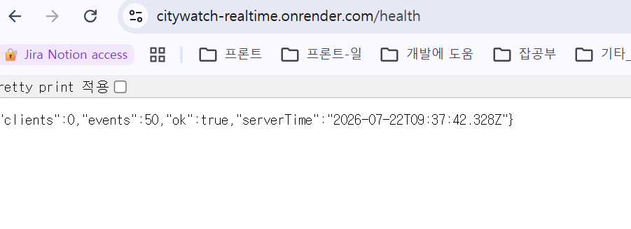
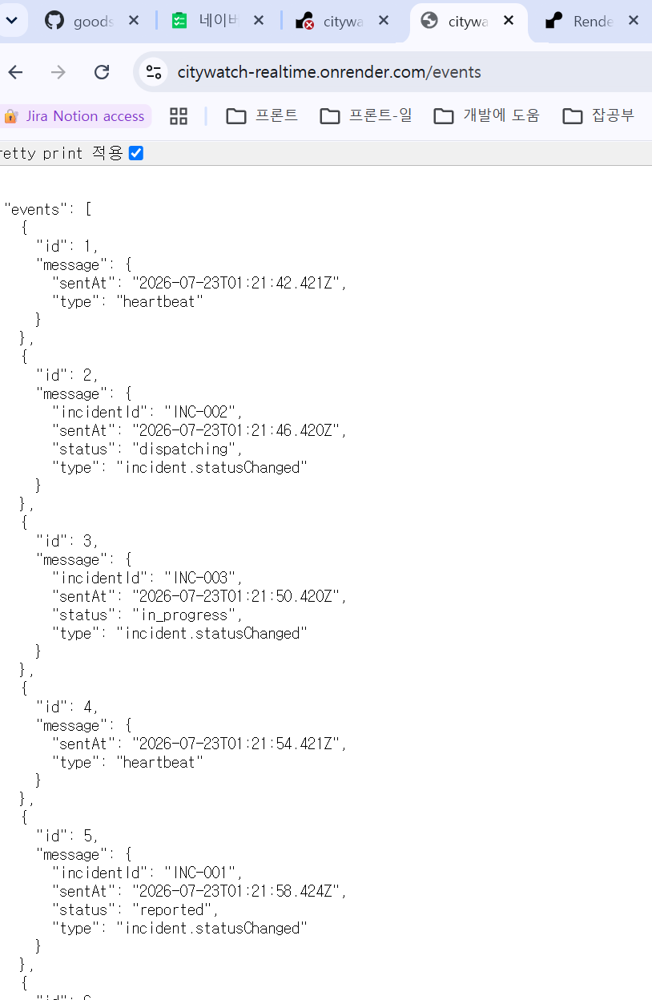

# [CityWatch 배포기 1/3] Render에 Node.js WebSocket 서버 배포하기

> 모노레포의 실시간 서버를 Render Web Service로 분리 배포하고, 빌드 명령과 포트 바인딩 오류를 해결하는 과정을 정리한다.

## CityWatch 배포 시리즈

CityWatch는 하나의 서비스처럼 보이지만 실제로는 실행 방식이 다른 세 개의 애플리케이션으로 구성되어 있다. 모든 애플리케이션을 한 플랫폼에 억지로 배포하지 않고 각 실행 방식에 맞는 플랫폼으로 나누어 배포한다.

| 편 | 제목 | 다루는 내용 |
|---|---|---|
| 1편 | **Render에 Node.js WebSocket 서버 배포하기** | `apps/realtime-server`를 Render Web Service로 배포한다. |
| 2편 | **Vercel에 Next.js Host와 Module Federation Remote 배포하기** | `apps/web`과 `apps/analytics-remote`를 각각 Vercel 프로젝트로 배포한다. |
| 3편 | **Vercel과 Render 연결하기: CityWatch 전체 배포 완성** | 운영 환경변수, Remote URL, HTTP API와 WebSocket 주소를 연결하고 전체 동작을 검증한다. |

이번 글은 시리즈의 **1편**이다. 화면을 제공하는 프론트엔드는 다루지 않고, HTTP API와 WebSocket 연결을 계속 유지해야 하는 `realtime-server`의 Render 배포에 집중한다.

### 전체 배포 구조

```text
사용자 브라우저
├─ Vercel: Next.js Host
├─ Vercel: Analytics Module Federation Remote
└─ Render: HTTP + WebSocket 실시간 서버
```

이렇게 분리하는 이유는 애플리케이션마다 실행 방식이 다르기 때문이다. Next.js Host와 Vite Remote는 웹 프론트엔드 배포에 적합한 Vercel을 사용하고, 지속적으로 실행되며 WebSocket 연결을 유지해야 하는 Node.js 서버는 Render Web Service를 사용한다.

## 0. 왜 이 서버는 Vercel이 아니라 Render에 배포하는가

배포 플랫폼을 먼저 고르는 것이 아니라, 현재 서버 코드가 어떤 방식으로 실행되는지 확인한 뒤 플랫폼을 선택해야 한다. `apps/realtime-server/src/server.mjs`에는 다음과 같은 코드가 있다.

```js
const clients = new Set();
const server = createServer(requestHandler);

server.on("upgrade", handleWebSocketUpgrade);

server.listen(port, () => {
  console.log(`CityWatch realtime server listening on port ${port}`);
});

setInterval(() => {
  broadcast(createIncidentEvent());
}, 4000);
```

이 코드는 단순히 요청 하나를 처리하고 종료되는 함수가 아니다. 하나의 Node.js 프로세스가 계속 살아 있으면서 다음 작업을 수행한다.

| 현재 코드의 요구사항 | 코드에서 확인하는 부분 |
|---|---|
| HTTP 서버를 직접 열어야 함 | `createServer(...)`, `server.listen(...)` |
| WebSocket 업그레이드를 직접 처리해야 함 | `server.on("upgrade", ...)` |
| 연결된 클라이언트를 메모리에 유지함 | `const clients = new Set()` |
| 일정 시간마다 이벤트를 생성함 | `setInterval(...)` |
| 모든 연결에 이벤트를 방송함 | `broadcast(...)` |

### Vercel의 기본 배포 방식과 다른 점

Vercel의 일반적인 서버 코드는 `app/api/.../route.ts` 같은 요청 핸들러 형태로 배포된다.

```ts
export async function GET() {
  return Response.json({ ok: true });
}
```

이 방식은 요청이 들어오면 Function이 실행되고 응답을 반환한다. 반면 현재 CityWatch 서버는 애플리케이션이 시작될 때 `server.listen(...)`으로 포트를 열고, 프로세스가 살아 있는 동안 WebSocket 연결과 타이머를 관리한다.

따라서 현재 파일을 `apps/realtime-server` 그대로 Vercel에 올린다고 해서 Render와 같은 방식으로 동작하지 않는다. Vercel Functions의 표준 제한 문서도 Vercel Functions를 WebSocket 서버로 사용하는 것을 지원하지 않는다고 설명한다. [Vercel Functions 제한 문서](https://vercel.com/docs/limits)

Vercel에서 실시간 기능을 구현하는 방법이 전혀 없는 것은 아니다. Vercel에는 Function 기반의 최신 WebSocket 패턴도 있지만, 이 경우 현재 서버를 다음처럼 다시 설계해야 한다.

- `server.listen(...)` 기반 서버를 Vercel Function 핸들러로 변경한다.
- Function 인스턴스가 바뀌어도 연결 상태를 유지할 외부 저장소를 사용한다.
- 연결 종료 후 재연결하는 클라이언트 로직을 추가한다.
- 인스턴스별 메모리 `Set`에 의존하는 현재 구조를 제거한다.

즉, Vercel 배포가 불가능해서가 아니라 **현재 구현을 변경하지 않고 배포하려는 목적에는 Render Web Service가 더 맞기 때문**이다.

### Render가 현재 코드와 맞는 이유

Render Web Service는 Node.js 프로세스를 실행하고, 서버가 `0.0.0.0`의 `PORT`에서 대기하도록 구성하면 외부 HTTP와 WebSocket 요청을 전달한다. Render 공식 문서도 Web Service에서 WebSocket 연결을 지원하며, `PORT` 환경변수와 `0.0.0.0` 바인딩을 요구한다. [Render Web Service 공식 문서](https://render.com/docs/web-services), [Render WebSocket 공식 문서](https://render.com/docs/websocket)

현재 코드는 Render가 요구하는 형태로 다음처럼 실행된다.

```js
const port = Number(process.env.PORT ?? 3001);

server.listen(port, () => {
  console.log(`CityWatch realtime server listening on port ${port}`);
});
```

로컬에서는 기본값 `3001`을 사용하고 Render에서는 Render가 제공하는 `PORT`를 사용한다. 서버가 시작되면 프로세스가 계속 실행되므로 `setInterval` 이벤트 생성과 WebSocket 연결 관리도 현재 코드 그대로 동작한다.

### 플랫폼 선택 결론

| 대상 | 배포 플랫폼 | 이유 |
|---|---|---|
| `apps/web` | Vercel | Next.js 웹 화면과 프론트엔드 배포에 적합 |
| `apps/analytics-remote` | Vercel | Vite Module Federation Remote의 정적 자산 제공 |
| `apps/realtime-server` | Render Web Service | 직접 포트를 열고 WebSocket과 장시간 실행 프로세스를 유지해야 함 |

이제부터 진행하는 Render 설정은 이 결정을 전제로 한다. 만약 나중에 실시간 서버를 Vercel 방식으로 다시 구현한다면, 그것은 단순한 배포 설정 변경이 아니라 서버 실행 모델을 변경하는 별도 작업이다.

## 1. 배포 구조 이해하기

CityWatch 프로젝트는 하나의 저장소 안에 여러 애플리케이션이 있는 모노레포 구조다.

```text
CityWatchFELab/
├─ apps/
│  ├─ web/                 # Next.js 프론트엔드
│  ├─ analytics-remote/    # Module Federation Remote
│  └─ realtime-server/     # HTTP + WebSocket 서버
└─ package.json
```

이번 글에서는 `apps/realtime-server`만 Render에 배포한다.

실시간 서버는 장시간 실행되면서 HTTP 요청과 WebSocket 연결을 계속 받아야 한다. 따라서 정적 파일만 제공하는 `Static Site`가 아니라 Node.js 프로세스를 계속 실행할 수 있는 **Web Service**를 선택한다.

---

## 2. 배포 전 서버 코드 설정

Render는 실행할 포트 번호를 `PORT` 환경변수로 전달한다. 따라서 서버 코드에서 포트를 고정하면 안 된다.

설정 파일:

```text
apps/realtime-server/src/server.mjs
```

```js
import { createServer } from "node:http";

const port = Number(process.env.PORT ?? 3001);

const server = createServer((request, response) => {
  response.end("CityWatch realtime server");
});

server.listen(port, () => {
  console.log(`CityWatch realtime server listening on port ${port}`);
});
```

### `PORT`를 이렇게 설정하는 이유

```js
const port = Number(process.env.PORT ?? 3001);
```

- 로컬에서는 `PORT`가 없으므로 `3001`을 사용한다.
- Render에서는 Render가 전달한 `PORT`를 사용한다.
- Render Web Service의 기본 포트는 일반적으로 `10000`이다.
- Render 화면에서 `PORT` 환경변수를 직접 만들 필요는 없다.

Render는 서버가 외부 요청을 받을 수 있도록 `0.0.0.0`에 바인딩할 것을 요구한다. Node.js에서 호스트를 생략한 `server.listen(port)`를 사용하면 특정 로컬 주소에 제한되지 않는다. [Render 포트 바인딩 공식 문서](https://render.com/docs/web-services#port-binding)

다음처럼 `127.0.0.1`을 지정하면 안 된다.

```js
server.listen(port, "127.0.0.1", () => {
  console.log(`Listening on http://127.0.0.1:${port}`);
});
```

`127.0.0.1`은 Render 컨테이너 내부에서만 접근할 수 있는 주소다. 이 상태에서는 다음 오류가 발생한다.

```text
No open ports detected on 0.0.0.0
```

---

## 3. 실행 명령 확인하기

`apps/realtime-server/package.json`에는 Render가 사용할 `start` 명령이 있어야 한다.

```json
{
  "scripts": {
    "dev": "node --watch src/server.mjs",
    "start": "node src/server.mjs",
    "test": "node --test src/websocket-frame.test.mjs"
  }
}
```

각 명령의 역할은 다음과 같다.

| 명령 | 용도 |
|---|---|
| `npm run dev` | 로컬 개발용, 파일 변경 감지 |
| `npm run start` | Render 운영 서버 실행 |
| `npm test` | WebSocket 관련 코드 테스트 |

Render의 `Start Command`에는 `npm run dev`가 아니라 `npm run start`를 사용한다. 운영 환경에서는 파일 변경 감시가 필요하지 않기 때문이다.

---

## 4. GitHub에 배포 코드 반영하기

Render는 로컬 컴퓨터의 코드를 읽지 않는다. GitHub의 지정된 브랜치에 올라간 코드만 배포한다.

이번 배포 기준 브랜치는 `master`다.

```bash
git switch master
git add apps/realtime-server/src/server.mjs
git commit -m "fix: bind realtime server for Render"
git push origin master
```

로컬에서 수정했더라도 `master`에 푸시하지 않았다면 Render에는 반영되지 않는다.

---

## 5. Render에서 Web Service 생성하기

이제부터는 Render 화면에서 실제로 값을 입력한다. 먼저 [Render 대시보드](https://dashboard.render.com/)에 로그인한다.

### 5-1. 서비스 종류 선택

1. 대시보드 오른쪽 위의 **New +** 버튼을 누른다.
2. 서비스 목록에서 **Web Service**를 선택한다.
3. `Static Site`, `Private Service`, `Background Worker`는 선택하지 않는다.

`Static Site`가 아니라 `Web Service`를 선택해야 한다. 이 서버는 정적 HTML이 아니라 계속 실행되는 Node.js 및 WebSocket 서버이기 때문이다.

### 5-2. GitHub 저장소 연결

Render와 GitHub를 처음 연결하면 GitHub App 설치 화면이 나타난다. 이 화면에서는 프로젝트 내부 폴더가 아니라 Render에 접근을 허용할 **GitHub 저장소 단위**를 선택한다.

1. **Only select repositories**를 선택한다.
2. **Select repositories**를 누른다.
3. `goodsosbva/citywatch-fe-lab`을 선택한다.
4. 아래 목록에 해당 저장소가 표시되는지 확인한다.
5. **Install**을 누른다.

```text
Only select repositories
goodsosbva/citywatch-fe-lab
```

여기서는 `apps/realtime-server`를 따로 선택할 수 없다. GitHub 권한은 저장소 단위로 설정하고, 실제 배포 대상 폴더는 뒤에서 Render의 `Root Directory`에 입력한다.

GitHub 연결이 끝나면 Render의 저장소 목록에서 `goodsosbva/citywatch-fe-lab` 오른쪽에 있는 **Connect**를 누른다. 이후 `Configure and deploy your new Web Service` 화면으로 이동한다.

---

## 6. Configure 화면에 값 입력하기

이 단계가 이번 실습의 핵심이다. Render가 자동으로 채운 값이 있더라도 그대로 배포하지 말고 아래 값과 한 항목씩 비교한다.

### 6-1. Source Code 확인

화면 위쪽 `Source Code`에 다음 저장소가 표시되어야 한다.

```text
goodsosbva / citywatch-fe-lab
```

다른 저장소가 표시된다면 오른쪽 **Edit**를 눌러 `citywatch-fe-lab`으로 변경한다. 이 항목은 Render가 어떤 GitHub 저장소에서 코드를 가져올지 결정한다.

### 6-2. Name 입력

`Name` 입력칸의 기존 값을 지우고 다음 값을 입력한다.

```text
citywatch-realtime
```

Name은 Render 서비스 이름이면서 기본 도메인의 일부가 된다.

```text
https://citywatch-realtime.onrender.com
```

이미 누군가 사용 중인 이름이면 Render가 다른 이름을 요구할 수 있다. 그 경우 고유한 이름을 사용하고, 이후 문서의 URL도 실제 발급된 주소로 바꿔야 한다.

### 6-3. Language 선택

`Language` 드롭다운에서 다음 값을 선택한다.

```text
Node
```

`apps/realtime-server`는 `node src/server.mjs`로 실행되는 Node.js 애플리케이션이기 때문이다. Docker나 Python을 선택하지 않는다.

### 6-4. Branch 입력

`Branch` 입력칸에서 기존 브랜치를 지우고 다음 값을 선택한다.

```text
master
```

Render는 이 브랜치에 올라온 커밋만 배포한다. 로컬의 `khs-branch`에서 코드를 수정했더라도 `master`에 반영하지 않으면 배포 결과는 바뀌지 않는다. 배포 로그에서도 다음 문장을 확인할 수 있다.

```text
Checking out commit ... in branch master
```

### 6-5. Region 선택

이번 실습에서는 화면에 기본으로 표시된 다음 값을 사용한다.

```text
Oregon (US West)
```

Region은 서버가 실제로 실행되는 데이터센터 위치다. 다른 Render 서비스나 데이터베이스를 함께 사용한다면 같은 Region을 선택하는 것이 좋다. 현재 실습은 단일 실시간 서버 배포이므로 기본값을 그대로 사용해도 된다.

### 6-6. Root Directory 입력

`Root Directory`는 `Optional`로 표시되지만 이 프로젝트에서는 반드시 입력해야 한다.

```text
apps/realtime-server
```

앞에 `/`를 붙이거나 저장소 이름을 포함하지 않는다.

```text
# 올바른 값
apps/realtime-server

# 잘못된 값
/apps/realtime-server
CityWatchFELab/apps/realtime-server
```

CityWatch 저장소에는 여러 앱이 들어 있다. Root Directory를 지정하면 Render는 `apps/realtime-server`를 작업 기준 폴더로 사용한다. 이후 Build Command와 Start Command도 이 폴더 안에서 실행된다.

Root Directory를 비워 두면 저장소 최상단에서 명령이 실행된다. 그러면 루트 워크스페이스 전체를 대상으로 빌드하거나 잘못된 스크립트를 실행할 수 있다. Render 공식 문서에서도 모노레포의 서비스별 배포에 Root Directory를 사용하도록 안내한다. [Render 모노레포 공식 문서](https://render.com/docs/monorepo-support)

### 6-7. Build Command 입력

Render가 자동으로 넣은 다음 값이 있다면 전부 지운다.

```text
npm install; npm run build
```

그다음 `Build Command`에 정확히 다음 값만 입력한다.

```text
npm install
```

이 서버는 `.mjs` 파일을 Node.js가 직접 실행하므로 별도의 컴파일 과정이 없다. `package.json`에도 `build` 스크립트가 없다. 따라서 `npm run build`를 넣으면 다음 오류로 배포가 중단된다.

```text
Missing script: "build"
```

### 6-8. Start Command 입력

`Start Command`의 `yarn start` 같은 기본값을 지우고 다음 값을 입력한다.

```text
npm run start
```

이 명령은 `apps/realtime-server/package.json`의 다음 설정을 실행한다.

```json
"start": "node src/server.mjs"
```

Build Command는 패키지를 설치하는 명령이고, Start Command는 설치가 끝난 뒤 실제 서버 프로세스를 실행하는 명령이다. 두 칸의 역할이 다르므로 서로 바꾸면 안 된다.

### 6-9. Instance Type 선택

`Instance Type`에서 **For hobby projects** 아래의 다음 항목을 선택한다.

```text
Free
$0 / month
```

Free 항목의 테두리나 선택 표시가 활성화됐는지 확인한다. 학습용 배포이므로 유료 `Starter`, `Standard`, `Pro`는 선택하지 않는다.

### 6-10. Environment Variables 비워 두기

`Environment Variables` 영역에는 아무 값도 추가하지 않는다.

특히 다음 값을 직접 만들지 않는다.

```text
PORT=10000
```


Render가 실행 시점에 `PORT`를 자동 제공하고 서버 코드는 `process.env.PORT`를 읽는다. 이번 실시간 서버에는 API 키나 데이터베이스 주소도 없으므로 환경변수가 필요하지 않다.

### 6-11. Advanced 설정

화면 아래의 **Advanced**를 펼친다. `Health Check Path` 항목이 보이면 다음 값을 입력한다.

```text
/health
```

Render는 이 경로를 호출해 서버가 정상적으로 요청을 처리하는지 확인할 수 있다. 코드에도 `/health` 라우트가 구현되어 있다.

```js
if (url.pathname === "/health") {
  writeJson(response, 200, { ok: true });
  return;
}
```

생성 화면에 `Health Check Path`가 보이지 않는다면 우선 배포한 뒤 다음 위치에서 설정한다.

```text
서비스 화면 → Settings → Health & Alerts → Health Check Path
```

입력값은 동일하게 `/health`다.

### 6-12. 배포 직전 최종 대조표

`Deploy Web Service`를 누르기 전에 화면의 값을 아래 표와 한 줄씩 대조한다.

| 항목 | 입력값 |
|---|---|
| Source Code | `goodsosbva/citywatch-fe-lab` |
| Name | `citywatch-realtime` |
| Language | `Node` |
| Branch | `master` |
| Region | `Oregon (US West)` |
| Root Directory | `apps/realtime-server` |
| Build Command | `npm install` |
| Start Command | `npm run start` |
| Instance Type | `Free` |
| Environment Variables | 입력하지 않음 |
| Health Check Path | `/health` |

---

## 7. 배포 실행과 로그 확인

### 7-1. 최초 배포 실행

1. 화면 맨 아래의 **Deploy Web Service**를 누른다.
2. Render가 GitHub의 `master` 브랜치를 복제할 때까지 기다린다.
3. Build Command와 Start Command가 차례로 실행되는 로그를 확인한다.
4. 배포 중 브라우저를 닫더라도 Render 서비스 화면에서 로그를 다시 볼 수 있다.

정상적인 로그는 다음과 같은 흐름으로 진행된다.

```text
Cloning from https://github.com/goodsosbva/citywatch-fe-lab
Checking out commit ... in branch master
Running build command 'npm install'
Running start command 'npm run start'
CityWatch realtime server listening on port 10000
Your service is live
```

반드시 확인할 부분은 다음 네 가지다.

1. 배포 브랜치가 `master`인지 확인한다.
2. Build Command가 `npm install`인지 확인한다.
3. Start Command가 `npm run start`인지 확인한다.
4. 로그에서 `127.0.0.1`이 아니라 `listening on port 10000`이 출력되는지 확인한다.

### 7-2. 설정을 잘못 입력했을 때 수정하기

배포가 실패해도 서비스를 새로 만들 필요는 없다. Render 서비스 화면에서 다음 순서로 이동한다.

```text
Settings → Build & Deploy
```

이 화면에서 `Root Directory`, `Build Command`, `Start Command`, `Branch`를 수정하고 **Save Changes**를 누른다. 저장 후 자동 배포가 시작되지 않으면 오른쪽 위에서 다음을 선택한다.

```text
Manual Deploy → Deploy latest commit
```

코드를 GitHub `master`에 새로 푸시한 경우에는 Auto-Deploy가 활성화되어 있으면 자동으로 최신 커밋을 배포한다. 자동 배포가 시작되지 않을 때도 `Deploy latest commit`을 사용하면 된다.

---

## 8. 배포 결과 확인하기

배포가 완료되면 Render가 다음 형태의 HTTPS 주소를 발급한다.

```text
https://citywatch-realtime.onrender.com
```

서버 상태는 `/health`에서 확인한다.

```text
https://citywatch-realtime.onrender.com/health
```

정상 응답 예시

```json
{
  "clients": 0,
  "events": 1,
  "ok": true,
  "serverTime": "2026-07-22T09:00:00.000Z"
}
```



이 응답에서 `"ok": true`가 나오면 다음 항목이 모두 정상이라는 뜻이다.

- Render 배포 성공
- Node.js 프로세스 실행 성공
- 외부 포트 연결 성공
- HTTP 요청 처리 성공

이벤트 조회 주소는 다음과 같다.

```text
https://citywatch-realtime.onrender.com/events
```




## 9. 루트 주소에서 `NOT_FOUND`가 나오는 이유

다음 주소를 열었을 때:

```text
https://citywatch-realtime.onrender.com/
```

아래 응답이 나올 수 있다.

```json
{"error":"NOT_FOUND"}
```

이것은 배포 실패가 아니다. 서버에는 `/health`, `/events`, `/ws`만 구현되어 있고 `/` 경로는 구현되어 있지 않기 때문이다.

```js
if (url.pathname === "/health") {
  // 상태 응답
  return;
}

if (url.pathname === "/events") {
  // 이벤트 응답
  return;
}

writeJson(response, 404, { error: "NOT_FOUND" });
```

서버에 접속하지 못했다면 JSON 응답 자체가 나오지 않는다. 따라서 `NOT_FOUND`가 표시된다는 것은 서버 연결에는 성공했지만 해당 경로가 없다는 의미다.

---

## 10. 무료 인스턴스 사용 시 주의사항

Render Free Web Service는 일정 시간 동안 HTTP 요청이나 WebSocket 메시지가 없으면 중지될 수 있다. 다음 요청이 들어오면 다시 시작되며, 이때 첫 응답이 늦어질 수 있다. 또한 로컬 파일 시스템은 재배포나 재시작 시 유지되지 않으므로 영구 데이터는 데이터베이스에 저장해야 한다. [Render 무료 서비스 공식 문서](https://render.com/docs/free)

이번 배포의 최종 확인 주소는 다음과 같다.

```text
https://citywatch-realtime.onrender.com/health
```

`"ok": true`가 반환되면 CityWatch 실시간 서버의 Render 배포가 완료된 것이다.

---

## 마무리

이번 편에서는 모노레포 전체가 아니라 `apps/realtime-server`만 Render Web Service로 배포했다. 배포 과정에서 중요했던 설정은 다음과 같다.

| 항목 | 최종 설정 |
|---|---|
| Service Type | `Web Service` |
| Branch | `master` |
| Root Directory | `apps/realtime-server` |
| Build Command | `npm install` |
| Start Command | `npm run start` |
| 포트 | `process.env.PORT` 사용 |
| 서버 바인딩 | `server.listen(port)` |
| 상태 확인 | `/health` |

`Missing script: "build"` 오류는 빌드 과정이 없는 서버에 `npm run build`를 실행해서 발생했다. `No open ports detected on 0.0.0.0` 오류는 서버를 `127.0.0.1`에만 바인딩해서 발생했다. 마지막으로 루트 주소의 `{"error":"NOT_FOUND"}` 응답은 배포 실패가 아니라 `/` 라우트가 구현되지 않았다는 의미다.

이제 Render에는 실시간 서버가 준비되었다. 다음 2편에서는 Next.js Host와 Module Federation Remote를 Vercel에 각각 배포한다. 마지막 3편에서는 Vercel 프론트엔드에 Render 주소를 운영 환경변수로 설정하고, Next.js Host, Module Federation Remote, HTTP API, WebSocket을 하나의 서비스로 연결한다.
