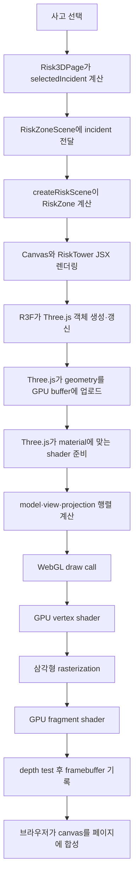

# 20-2. R3F / Three.js X-Ray 증거

## 1. 이번 단계의 목적

`/risk-3d`에는 이미 실제 React Three Fiber와 Three.js 장면이 있었다. 이번 단계는 같은 장면을 다시 만드는 작업이 아니다.

```txt
기존 기능
→ REST API에서 Incident[] 조회
→ 2D 지도에서 사고 선택
→ 선택 Incident를 R3F Canvas에 전달
→ Three.js geometry와 material로 위험 기둥 렌더링

20-2 추가 기능
→ X-Ray selector에 R3F / Three.js 관점 추가
→ 선택 시 /risk-3d로 한 번 이동
→ R3F 장면 경계만 강조
→ 실제 코드의 데이터·렌더링 파이프라인을 증거 패널로 표시
```

새 3D 엔진, 새 전역 상태, 새 API, 새 의존성은 추가하지 않았다.

## 2. R3F와 Three.js의 관계

Three.js는 WebGL 장면을 만드는 JavaScript 3D 엔진이다.

```ts
import {
  DoubleSide,
  SRGBColorSpace,
  TextureLoader,
} from "three";
```

geometry, material, texture, camera, scene 같은 실제 3D 객체를 제공한다.

React Three Fiber는 Three.js를 React JSX로 선언할 수 있게 하는 React renderer다.

```ts
import { Canvas, useLoader, useThree } from "@react-three/fiber";
```

역할은 다음처럼 나뉜다.

```txt
React Three Fiber
→ Canvas 생성
→ React 컴포넌트 생명주기와 Three.js 장면 연결
→ useLoader, useThree 같은 React hook 제공

Three.js
→ TextureLoader
→ OrbitControls
→ geometry
→ material
→ WebGL 렌더링에 필요한 실제 3D 객체 제공
```

R3F가 Three.js를 대체하는 것이 아니다. R3F가 React 코드와 Three.js 객체 사이를 연결한다.

## 3. 의존성 설정 위치와 이유

의존성은 `apps/web/package.json`에 있다.

```json
{
  "dependencies": {
    "@react-three/fiber": "^9.6.1",
    "three": "^0.185.1"
  },
  "devDependencies": {
    "@types/three": "^0.185.1"
  }
}
```

이 설정이 루트가 아니라 `apps/web/package.json`에 있는 이유는 R3F Canvas를 렌더링하는 실행 주체가 `apps/web`이기 때문이다.

```txt
apps/web
└─ app/risk-3d/risk-zone-scene.tsx
   ├─ @react-three/fiber 사용
   └─ three 사용
```

20-2에서는 이 의존성이 이미 설치돼 있었으므로 패키지를 추가하지 않았다.

## 4. X-Ray mode의 시작점

파일: `apps/web/app/xray-selector.tsx`

### 4.1 허용 가능한 mode에 r3f 추가

```ts
export type XRayProof =
  | "fsd-style"
  | "module-federation"
  | "monorepo"
  | "openlayers"
  | "r3f";
```

`XRayProof`는 X-Ray selector가 허용하는 기술 증거 ID의 TypeScript union이다.

`"r3f"`가 없으면 다음 코드는 타입 안전하게 작성할 수 없다.

```ts
mode === "r3f";
proofs={["r3f"]}
```

### 4.2 selector option 추가

```tsx
<option value="r3f">R3F / Three.js</option>
```

사용자가 보는 이름은 `R3F / Three.js`, URL과 코드에서 사용하는 값은 `r3f`다.

```txt
화면 표시: R3F / Three.js
상태 값:   r3f
URL:       ?xray=r3f
```

### 4.3 URL 입력 검증

```ts
function getXRayMode(value: string | null): XRayMode {
  return value === "off" ||
    value === "fsd-style" ||
    value === "module-federation" ||
    value === "monorepo" ||
    value === "openlayers" ||
    value === "r3f"
    ? value
    : "all";
}
```

URL query는 사용자가 직접 바꿀 수 있는 외부 입력이다. 따라서 문자열을 그대로 `XRayMode`로 단언하지 않고 허용 목록과 비교한다.

```txt
?xray=r3f     → r3f
?xray=unknown → all
```

### 4.4 대표 페이지로 한 번 이동

```ts
function getXRayPathname(mode: XRayMode, currentPathname: string) {
  if (mode === "module-federation" || mode === "monorepo") return "/";
  if (mode === "openlayers") return "/map";
  if (mode === "r3f") return "/risk-3d";
  return currentPathname;
}
```

사용자가 selector에서 R3F를 선택한 순간에만 `/risk-3d`를 반환한다.

```txt
홈에서 R3F 선택
→ /risk-3d?xray=r3f
```

그 뒤 전역 메뉴로 지도 페이지를 누르면 현재 pathname을 다시 R3F 대표 페이지로 바꾸지 않는다.

```txt
/risk-3d?xray=r3f
→ 지도 관제 클릭
→ /map?xray=r3f
→ /risk-3d로 되돌아가지 않음
```

## 5. Risk3DPage가 R3F 관점을 읽는 과정

파일: `apps/web/app/risk-3d/page.tsx`

```ts
const { enabled: xray, mode } = useXRay();
```

한 번의 호출로 기본 X-Ray 활성 여부와 현재 mode를 함께 읽는다.

```txt
useXRay()
→ enabled: 전체 또는 기본 FSD-style X-Ray 여부
→ mode: 현재 선택한 X-Ray 문자열
```

`useXRay()`는 다음 값을 반환한다.

```ts
{
  enabled:
    mode === "all" ||
    (mode !== "off" && ["fsd-style"].includes(mode)),
  mode,
}
```

R3F 전용 여부는 같은 `mode`를 필요한 위치에서 직접 비교한다.

```ts
mode === "r3f"
```

## 6. R3F 관점에서 3D 모드를 여는 이유

`Risk3DPage`의 기본 화면은 전체 사고를 비교하는 2D 지도다.

```ts
const [viewMode, setViewMode] = useState<RiskViewMode>("2d");
```

하지만 R3F X-Ray를 선택했는데 OpenLayers 2D 화면만 보이면 선택한 기술의 실제 실행 결과를 바로 확인할 수 없다.

사고 데이터가 준비된 뒤 R3F mode일 때만 3D로 전환한다.

```ts
useEffect(() => {
  if (mode === "r3f" && selectedIncident) setViewMode("3d");
}, [mode, selectedIncident]);
```

`selectedIncident` 조건이 필요한 이유는 `RiskZoneScene`의 입력이 반드시 유효한 사고 한 건이어야 하기 때문이다.

```txt
mode만 r3f, 사고 없음
→ 3D 전환하지 않음

mode가 r3f, selectedIncident 존재
→ viewMode = "3d"
→ RiskZoneScene 렌더링
```

## 7. selectedIncident는 어디서 오는가

`Risk3DPage`는 REST 응답 배열과 Redux 선택 ID를 합쳐 선택 사고를 만든다.

```ts
const selectedIncidentId = useAppSelector(selectSelectedIncidentId);

const selectedIncident = useMemo(
  () => incidents.find((incident) => incident.id === selectedIncidentId),
  [incidents, selectedIncidentId],
);
```

최초 조회 결과에 현재 선택 ID가 없다면 위험 점수가 가장 높은 사고를 선택한다.

```ts
dispatch(setSelectedIncidentId(getHighestRiskIncidentId(nextIncidents)));
```

전체 흐름:

```txt
fetchIncidents(query)
→ Incident[]
→ setIncidents(nextIncidents)
→ selectedIncidentId 유효성 확인
→ 필요하면 최고 위험 사고 ID를 Redux에 저장
→ incidents.find(...)
→ selectedIncident
→ RiskZoneScene incident prop
```

## 8. R3F 장면 X-Ray 경계

```tsx
<XRayBox
  className="risk-3d-xray-scene"
  enabled={xray || (mode === "r3f" && viewMode === "3d")}
  label={
    viewMode === "2d"
      ? "widget/OpenLayersIncidentMap"
      : "widget/RiskZoneScene"
  }
  packageName="apps/web"
  proofs={
    viewMode === "2d"
      ? ["fsd-style"]
      : ["fsd-style", "r3f"]
  }
  stacks={
    viewMode === "2d"
      ? ["OpenLayers", "OpenStreetMap"]
      : ["React Three Fiber", "Three.js", "OpenStreetMap"]
  }
>
```

R3F 전용 경계는 실제 3D 장면이 렌더링될 때만 켠다.

```txt
mode = r3f, viewMode = 2d
→ R3F 장면 경계 없음

mode = r3f, viewMode = 3d
→ widget/RiskZoneScene 경계 표시
```

`proofs={["fsd-style", "r3f"]}`는 이 UI 경계가 FSD-style widget이면서 R3F 기술 증거라는 메타데이터다.

## 9. 증거 패널

R3F mode에서만 증거 패널을 렌더링한다.

```tsx
{mode === "r3f" ? (
  <XRayBox
    enabled={mode === "r3f"}
    label="feature/risk-3d/R3FThreePipeline"
    packageName="apps/web"
    proofs={["r3f"]}
    stacks={[
      "React Three Fiber",
      "Three.js",
      "WebGL",
      "OpenStreetMap",
    ]}
  >
    <R3FEvidencePanel />
  </XRayBox>
) : null}
```

패널은 새 계산을 실행하지 않는다. 이미 실행 중인 코드의 책임과 위치를 화면에 설명한다.

표시 파이프라인:

```txt
Incident
→ calculateIncidentRisk
→ RiskZone

Incident.location
→ createMapTiles
→ OSM Texture[]

RiskZone
→ R3F Canvas
→ cylinderGeometry
→ meshStandardMaterial
```

표시하는 코드 근거:

```txt
<Canvas camera={{ fov: 38 }}>
useLoader(TextureLoader, tileUrls)
<cylinderGeometry args={[...]} />
controls.dispose()
```

## 10. RiskZoneScene의 실제 시작점

파일: `apps/web/app/risk-3d/risk-zone-scene.tsx`

```tsx
export function RiskZoneScene({ incident }: RiskZoneSceneProps) {
  const [resetViewKey, setResetViewKey] = useState(0);
  const scene = createRiskScene(incident);
```

입력은 `Incident` 한 건이다.

```ts
type RiskZoneSceneProps = {
  incident: Incident;
};
```

전체 사고 배열을 Canvas에 넘기지 않는다. 전체 위치 비교는 2D OpenLayers, 선택 사고 상세는 3D가 담당한다.

## 11. Incident를 3D 값으로 변환

```ts
function createRiskScene(incident: Incident) {
  const { latitude, longitude } = incident.location;

  if (!Number.isFinite(latitude) || !Number.isFinite(longitude)) {
    return {
      center: { latitude: 37.5665, longitude: 126.978 },
      zone: undefined,
    };
  }

  const risk = calculateIncidentRisk(incident);
```

좌표가 숫자가 아니면 기본 지도 중심만 반환하고 위험 기둥은 만들지 않는다.

유효한 입력은 다음 값으로 변환한다.

```ts
zone: {
  color: incidentRiskLevelColors[risk.level],
  height: 0.35 + risk.score / 45,
  impactRadius:
    0.48 + Math.sqrt(Math.max(incident.affectedPeople, 0)) * 0.07,
  incident,
  position: [0, 0, 0],
  radius:
    0.3 + Math.min(Math.max(incident.affectedPeople, 0), 100) / 650,
  risk,
}
```

입력과 출력 관계:

| Incident 값 | 3D 값 | 화면 의미 |
| --- | --- | --- |
| `location` | `center` | OSM 지도 중심 |
| `risk.score` | `height` | 위험 점수가 높을수록 높은 기둥 |
| `risk.level` | `color` | 위험 단계 색상 |
| `affectedPeople` | `radius` | 기둥 굵기 |
| `affectedPeople` | `impactRadius` | 반투명 비교 링 |

## 12. R3F Canvas

```tsx
<Canvas
  camera={{ fov: 38, position: detailCameraPosition }}
  dpr={[1, 1.5]}
  fallback={
    <p className="state-message state-message--error" role="alert">
      이 브라우저에서는 WebGL 3D 장면을 표시할 수 없습니다.
    </p>
  }
  gl={{ antialias: true, powerPreference: "high-performance" }}
>
```

각 속성의 역할:

```txt
camera
→ 초기 시야각과 위치

dpr={[1, 1.5]}
→ 지나치게 높은 픽셀 비율로 렌더링 비용이 커지는 것을 제한

fallback
→ WebGL을 사용할 수 없는 브라우저의 오류 UI

gl.antialias
→ 기둥과 링 경계의 계단 현상 완화

powerPreference
→ 가능하면 고성능 GPU 경로 요청
```

Canvas 내부 JSX:

```tsx
<ambientLight intensity={0.75} />
<hemisphereLight args={["#ffffff", "#64748b", 1.8]} />
<directionalLight intensity={2.2} position={[8, 12, 6]} />

<Suspense fallback={<GroundPlaceholder />}>
  <MapGround center={scene.center} />
</Suspense>

<MapControls resetViewKey={resetViewKey} />
{scene.zone ? <RiskTower zone={scene.zone} /> : null}
```

## 13. OpenStreetMap 타일을 Three.js texture로 변환

`createMapTiles(center)`는 사고 좌표 주변 3×3 타일 주소와 장면 위치를 계산한다.

```ts
const mapZoom = 16;
const mapTileCount = 3;
```

`toMapTilePoint`는 위도·경도를 Web Mercator 타일 좌표로 바꾼다.

```txt
Incident.location
→ 위도 제한
→ radians
→ Web Mercator x/y
→ zoom 16의 tileX/tileY
→ https://tile.openstreetmap.org/{z}/{x}/{y}.png
```

R3F의 `useLoader`가 Three.js `TextureLoader`를 실행한다.

```ts
const textures = useLoader(
  TextureLoader,
  tiles.map((tile) => tile.url),
);
```

텍스처는 바닥 plane의 material에 연결된다.

```tsx
<mesh>
  <planeGeometry args={[mapTileWorldSize, mapTileWorldSize]} />
  <meshBasicMaterial map={textures[index]} />
</mesh>
```

## 14. Three.js 위험 기둥

`RiskTower`는 세 개의 mesh를 만든다.

```txt
영향 인원 링
선택 위치 흰색 링
위험 점수 기둥
```

기둥 geometry:

```tsx
<cylinderGeometry
  args={[
    zone.radius * 0.9,
    zone.radius,
    zone.height,
    20,
  ]}
/>
```

material:

```tsx
<meshStandardMaterial
  color={zone.color}
  emissive={zone.color}
  emissiveIntensity={0.12}
  metalness={0.08}
  roughness={0.5}
/>
```

R3F JSX지만 실제 실행 시에는 Three.js `CylinderGeometry`와 `MeshStandardMaterial` 객체가 만들어진다.

## 15. 카메라 조작과 정리

```ts
const { camera, gl } = useThree();
```

`useThree()`는 현재 R3F Canvas의 Three.js camera와 WebGL renderer를 제공한다.

```ts
const controls = new OrbitControls(camera, gl.domElement);
controls.enablePan = false;
controls.enableRotate = false;
controls.maxDistance = 20;
controls.minDistance = 7;
```

확대·축소만 허용하고 이동과 회전을 막는다. 선택 사고의 실제 지도 중심과 기둥 바닥 관계가 흐트러지지 않게 하기 위해서다.

컴포넌트가 사라질 때 Three.js event listener를 정리한다.

```ts
return () => {
  controls.dispose();
  controlsRef.current = null;
};
```

## 16. 접근성

WebGL Canvas의 mesh는 일반 HTML 버튼처럼 키보드와 스크린 리더가 자동으로 접근할 수 없다.

따라서 사고 선택은 기존 HTML 버튼과 2D 지도에 남겨 두었다.

```tsx
<button
  aria-pressed={selected}
  onClick={() => onSelect(incident.id)}
  type="button"
>
```

3D 장면에는 화면 읽기용 텍스트도 있다.

```tsx
<span className="sr-only">
  {`${incident.id} 위험 점수 ${risk.score}, ${risk.level}`}
</span>
```

`시점 초기화`도 실제 HTML button이므로 키보드로 실행할 수 있다.

## 17. 증거 패널 공통 CSS

20-1 OpenLayers 증거 패널에 이미 같은 레이아웃이 있었다. R3F 전용 스타일을 복사하지 않고 기술 공통 이름으로 바꿨다.

```txt
openlayers-evidence → technology-evidence
openlayers-flow     → technology-flow
openlayers-code     → technology-code
```

OpenLayers와 R3F 패널이 같은 CSS를 사용한다.

```tsx
className="panel technology-evidence"
className="technology-flow"
className="technology-code"
```

새 CSS 시스템이나 컴포넌트 추상화는 만들지 않았다.

## 18. 전체 실행 흐름

```txt
사용자가 X-Ray에서 R3F / Three.js 선택
→ selectMode("r3f")
→ URL query에 xray=r3f 기록
→ getXRayPathname("r3f", pathname)
→ /risk-3d로 한 번 이동
→ Risk3DPage가 useXRay()로 mode 확인
→ 필요한 위치에서 mode === "r3f" 비교
→ REST Incident[] 조회
→ Redux selectedIncidentId와 결합
→ selectedIncident 생성
→ mode === "r3f" && selectedIncident
→ viewMode를 "3d"로 변경
→ RiskZoneScene(incident) 렌더링
→ createRiskScene
→ createMapTiles
→ R3F Canvas
→ Three.js texture, geometry, material 생성
→ WebGL Canvas 표시
→ R3F 경계와 증거 패널 표시
```

## 19. 검증 결과

```txt
npm run typecheck 통과
npm test 통과: 8 tests
git diff --check 통과

브라우저:
R3F / Three.js option 표시
선택 시 /risk-3d?xray=r3f 이동
3D 선택 지점 자동 활성화
실제 Canvas 렌더링
widget/RiskZoneScene X-Ray 경계 표시
feature/risk-3d/R3FThreePipeline 표시
증거 패널 코드와 데이터 흐름 표시
지도 메뉴 이동 후 /map?xray=r3f 유지
OpenLayers 증거 패널 공통 CSS 회귀 없음
console error 없음
```

## 20. 의도적으로 추가하지 않은 것

```txt
새 3D 라이브러리
새 전역 상태
전체 사고를 한 Canvas에 렌더링
기둥 클릭 선택
회전 애니메이션
별도 증거 패널 컴포넌트 파일
OpenLayers와 R3F에 중복 CSS
```

현재 요구는 선택 사고 한 건의 실제 R3F/Three.js 실행 경로를 X-Ray로 증명하는 것이므로 기존 장면과 한 페이지 안의 작은 증거 패널이면 충분하다.

## 21. WebGL 실습의 최종 목표

이 실습의 목표는 WebGL API를 처음부터 직접 작성하는 것이 아니다. 현재 코드 한 곳을 조금씩 바꾸면서 다음 연결을 눈으로 확인하는 것이다.

> 실습 시작 상태: 위험 비콘 기능은 현재 애플리케이션 코드에 들어 있지 않다. 아래 코드는 완성 결과를 설명하는 현재 구현 문서가 아니라, 폐하가 순서대로 직접 추가할 실습 코드다.

한꺼번에 최종 코드를 복사하지 않는다. 각 실습에서 지정한 한 부분만 수정하고 화면 변화를 확인한 뒤 다음 단계로 이동한다.

```txt
React 데이터
→ R3F JSX
→ Three.js 객체
→ geometry buffer와 shader
→ WebGL draw call
→ GPU가 계산한 픽셀
→ canvas
```

실습이 끝나면 다음 질문에 코드로 답할 수 있어야 한다.

```txt
새 도형은 어디에 추가하는가?
크기와 위치는 어떤 값으로 정하는가?
색과 빛 반응은 어디서 바꾸는가?
카메라와 mesh 이동은 어떻게 다른가?
React state가 바뀌면 GPU 화면까지 어떻게 갱신되는가?
mesh를 하나 늘리면 렌더링 비용은 왜 늘어나는가?
WebGL mesh에 접근성 대체 수단이 필요한 이유는 무엇인가?
```

실습 파일은 하나만 사용한다.

```txt
apps/web/app/risk-3d/risk-zone-scene.tsx
```

새 예제 앱, 새 패키지, 별도 shader 라이브러리는 필요하지 않다. 현재 설치된 React Three Fiber와 Three.js만 사용한다.

## 22. 코드와 GPU를 잇는 전체 순서도



실습 순서는 위 파이프라인의 앞에서 뒤로 이동한다.

```txt
실습 0: 기준 화면 확보
→ 실습 1: React와 CPU 데이터 확인
→ 실습 2: 데이터가 geometry 크기가 되는 과정 확인
→ 실습 3: geometry의 삼각형 구조 확인
→ 실습 4: material·shader·조명 관계 확인
→ 실습 5: mesh와 카메라 행렬 확인
→ 실습 6: draw call과 GPU 자원 수 확인
→ 실습 7: 새 경고 구체를 직접 추가
→ 실습 8: React 상태 변경이 장면 갱신으로 이어지는지 확인
→ 원상 복구와 검증
```

순서가 중요한 이유는 앞 단계의 입력을 모른 채 뒤 단계의 픽셀만 보면 문제가 데이터, geometry, material, 카메라 중 어디에서 생겼는지 구분하기 어렵기 때문이다.

## 23. 실습 0 — 기준 화면을 먼저 확보한다

### 23.1 개발 서버 실행

저장소 루트에서 실행한다.

```bash
npm run dev:web
```

브라우저에서 다음 주소를 연다.

```txt
http://127.0.0.1:3000/risk-3d?xray=r3f
```

확인 순서:

```txt
1. 사고 데이터가 로딩될 때까지 기다린다.
2. "3D 선택 지점"이 활성화됐는지 확인한다.
3. 3D 화면에 지도, 링 두 개, 위험 기둥이 보이는지 확인한다.
4. "시점 초기화"와 확대·축소가 동작하는지 확인한다.
5. 브라우저 콘솔에 오류가 없는지 확인한다.
```

### 23.2 기준값을 기록한다

실습 전에 다음 값을 메모하거나 화면을 캡처한다.

```txt
선택 사고 ID
위험 점수
기둥 높이의 대략적인 모습
기둥 색
카메라 시점
```

이유:

```txt
기준 화면이 없으면
→ 코드를 바꾼 뒤 무엇이 달라졌는지 판단하기 어렵다.

한 번에 한 값만 바꾸면
→ 화면 변화의 원인을 그 한 줄로 좁힐 수 있다.
```

현재 작업 트리에 다른 변경이 있을 수 있으므로 실습 전체를 `git restore`로 되돌리지 않는다. 각 실습에서 바꾼 한두 줄만 편집기 실행 취소로 복구한다.

## 24. 실습 1 — React와 CPU 데이터부터 확인한다

`RiskZoneScene`에서 다음 줄을 찾는다.

```ts
const scene = createRiskScene(incident);
```

바로 아래에 임시 로그를 넣는다.

```ts
console.table({
  incidentId: incident.id,
  riskScore: scene.zone?.risk.score,
  height: scene.zone?.height,
  radius: scene.zone?.radius,
});
```

브라우저 콘솔에서 다음 관계를 확인한다.

```txt
Incident
→ calculateIncidentRisk
→ risk.score
→ createRiskScene
→ scene.zone.height와 scene.zone.radius
```

### 왜 이 실습을 먼저 하는가

이 값들은 아직 GPU에 올라간 값이 아니다. JavaScript가 CPU에서 계산한 평범한 객체다.

```ts
scene.zone.height
```

이 값이 나중에 다음 JSX prop으로 전달된다.

```tsx
<cylinderGeometry args={[..., zone.height, ...]} />
```

따라서 기둥 높이가 잘못됐다면 먼저 `risk.score`와 `zone.height`를 확인해야 한다. shader나 WebGL을 먼저 의심할 이유가 없다.

개발 모드에서 같은 로그가 두 번 이상 보일 수 있다. React의 개발용 검증 렌더링이나 상태 갱신 때문일 수 있으며, 로그 횟수를 WebGL draw call 횟수로 해석하면 안 된다.

확인이 끝나면 `console.table`을 제거한다. 임시 학습 로그는 제품 코드에 남길 이유가 없다.

## 25. 실습 2 — 데이터가 geometry 크기로 바뀌는 과정

`createRiskScene`의 높이 계산을 찾는다.

```ts
height: 0.35 + risk.score / 45,
```

실습 중에만 나누는 수를 `45`에서 `25`로 바꾼다.

```ts
height: 0.35 + risk.score / 25,
```

파일을 저장하고 기둥이 더 높아졌는지 확인한다.

### 코드 흐름

```txt
risk.score
→ height 계산 결과 증가
→ RiskTower의 zone.height 증가
→ cylinderGeometry의 세 번째 인자 증가
→ Three.js CylinderGeometry의 꼭짓점 위치가 달라짐
→ 새 position buffer가 GPU에 전달됨
→ vertex shader가 더 높은 꼭짓점 위치를 계산
→ 화면의 기둥이 높아짐
```

현재 geometry 선언:

```tsx
<cylinderGeometry
  args={[
    zone.radius * 0.9,
    zone.radius,
    zone.height,
    20,
  ]}
/>
```

Three.js 명령형 코드로 생각하면 다음과 같다.

```ts
new CylinderGeometry(
  zone.radius * 0.9,
  zone.radius,
  zone.height,
  20,
);
```

세 번째 값이 높이고 네 번째 값이 원 둘레의 분할 수다.

### 왜 `createRiskScene`에서 계산하는가

`risk.score`를 화면 의미인 `height`로 바꾸는 일은 데이터 변환이다. `RiskTower` 안에서 위험 점수 공식을 다시 만들면 데이터 규칙과 렌더링 규칙이 섞인다.

```txt
createRiskScene
→ 어떤 데이터를 어떤 시각 값으로 바꿀지 결정

RiskTower
→ 전달받은 시각 값으로 어떤 도형을 그릴지 결정
```

확인 후 `25`를 다시 `45`로 복구한다.

## 26. 실습 3 — geometry가 삼각형 묶음이라는 것을 확인한다

### 26.1 원기둥을 육각기둥으로 바꾼다

`cylinderGeometry`의 마지막 값 `20`을 `6`으로 바꾼다.

```tsx
<cylinderGeometry
  args={[zone.radius * 0.9, zone.radius, zone.height, 6]}
/>
```

예상 결과:

```txt
20분할 원기둥
→ 옆면이 비교적 둥글게 보임

6분할 원기둥
→ 육각기둥처럼 각져 보임
```

이유:

WebGL은 수학적인 원기둥을 직접 그리지 않는다. Three.js가 원기둥 표면을 여러 삼각형으로 나누고, WebGL은 그 삼각형만 그린다. 분할 수를 줄이면 꼭짓점과 삼각형 수가 줄어 각진 형태가 드러난다.

### 26.2 삼각형 선을 직접 본다

같은 mesh의 `meshStandardMaterial`에 `wireframe`을 임시로 추가한다.

```tsx
<meshStandardMaterial
  color={zone.color}
  emissive={zone.color}
  emissiveIntensity={0.12}
  metalness={0.08}
  roughness={0.5}
  wireframe
/>
```

예상 결과는 원기둥을 구성하는 삼각형의 선이 보이는 것이다.

Three.js geometry 내부에는 개념적으로 다음 데이터가 있다.

```txt
position
→ 각 꼭짓점의 x, y, z

normal
→ 조명 계산에 사용할 표면 방향

uv
→ 텍스처 좌표

index
→ 어떤 꼭짓점 세 개를 한 삼각형으로 묶을지 지정
```

Three.js는 이 배열을 WebGL buffer로 만들어 GPU에 올린다.

```js
const buffer = gl.createBuffer();
gl.bindBuffer(gl.ARRAY_BUFFER, buffer);
gl.bufferData(gl.ARRAY_BUFFER, positions, gl.STATIC_DRAW);
```

현재 프로젝트가 위 WebGL 코드를 직접 호출하지 않는 이유는 Three.js가 geometry의 buffer 생성과 수명 관리를 대신하기 때문이다.

확인이 끝나면 분할 수를 `20`으로 되돌리고 `wireframe`을 제거한다.

## 27. 실습 4 — material, shader, 조명의 관계

### 27.1 조명을 사용하는 material 확인

현재 기둥은 `meshStandardMaterial`을 사용한다.

```tsx
<meshStandardMaterial
  color={zone.color}
  emissive={zone.color}
  emissiveIntensity={0.12}
  metalness={0.08}
  roughness={0.5}
/>
```

`meshStandardMaterial`은 표면 normal, 카메라, 조명, roughness, metalness를 사용해 픽셀 색을 계산한다.

먼저 `directionalLight`의 세기를 잠시 줄인다.

```tsx
<directionalLight intensity={0.1} position={[8, 12, 6]} />
```

원래 값은 `2.2`다. 기둥 표면의 밝기와 입체감이 달라지는지 확인한다.

### 27.2 조명을 사용하지 않는 material과 비교

기둥의 material을 실습 중에만 다음 한 줄로 바꾼다.

```tsx
<meshBasicMaterial color={zone.color} />
```

`directionalLight`의 intensity를 바꿔도 기둥 색이 거의 영향을 받지 않는지 확인한다.

차이:

```txt
meshBasicMaterial
→ 조명 계산 없음
→ 색이나 texture를 거의 그대로 표시

meshStandardMaterial
→ 조명과 표면 방향을 계산
→ 빛 방향에 따라 밝고 어두운 면이 생김
```

### shader는 어디서 생기는가

현재 코드에는 vertex shader와 fragment shader 문자열이 없다. Three.js가 선택한 material과 조명 설정을 보고 필요한 shader 프로그램을 준비하기 때문이다.

개념상 다음 값들이 shader 입력이 된다.

```txt
geometry.position, geometry.normal
→ vertex attribute

mesh의 position·rotation·scale
→ model matrix

camera
→ view matrix와 projection matrix

material.color, roughness, metalness
→ uniform

light 위치와 세기
→ uniform
```

fragment shader는 삼각형 안의 각 픽셀 후보마다 이 입력을 사용해 최종 색을 계산한다.

확인 후 다음 두 값을 원상 복구한다.

```txt
directionalLight intensity = 2.2
material = meshStandardMaterial의 기존 속성
```

## 28. 실습 5 — mesh 이동과 카메라 이동을 구분한다

### 28.1 mesh의 model matrix 확인

기둥 mesh의 위치는 다음과 같다.

```tsx
<mesh position={[0, zone.height / 2, 0]}>
```

Y 위치를 실습 중에만 `1`만큼 올린다.

```tsx
<mesh position={[0, zone.height / 2 + 1, 0]}>
```

기둥이 지도 바닥에서 떠 있는지 확인한다.

왜 원래 값이 `zone.height / 2`인가:

```txt
CylinderGeometry의 중심
→ geometry 한가운데

기둥 높이
→ zone.height

중심을 zone.height / 2만큼 올림
→ 기둥 아래쪽 끝이 y = 0에 닿음
```

이 `position`은 mesh의 model matrix에 반영된다. geometry의 원본 꼭짓점 데이터를 직접 다시 작성하지 않고, 모든 꼭짓점에 같은 이동 변환을 적용한다.

확인 후 `+ 1`을 제거한다.

### 28.2 카메라의 view·projection matrix 확인

카메라 초기 위치는 다음 상수다.

```ts
const detailCameraPosition: [number, number, number] = [0, 12, 8.5];
```

실습 중에만 다음처럼 바꾼다.

```ts
const detailCameraPosition: [number, number, number] = [6, 6, 6];
```

장면을 보는 방향과 거리가 달라지는지 확인한다.

그다음 `Canvas`의 `fov`를 `38`에서 `70`으로 바꿔 본다.

```tsx
camera={{ fov: 70, position: detailCameraPosition }}
```

`position`은 카메라가 세계의 어디에 있는지를 바꾸고, `fov`는 한 화면에 얼마나 넓은 범위를 담는지를 바꾼다.

vertex shader가 최종 화면 위치를 계산할 때 사용하는 핵심 식은 다음과 같다.

```glsl
gl_Position =
  projectionMatrix *
  viewMatrix *
  modelMatrix *
  vec4(position, 1.0);
```

현재 코드와 대응시키면 다음과 같다.

```txt
position
→ CylinderGeometry의 꼭짓점

modelMatrix
→ mesh position, rotation, scale

viewMatrix
→ camera의 위치와 방향

projectionMatrix
→ camera의 fov, aspect, near, far
```

확인 후 카메라 위치와 `fov`를 각각 `[0, 12, 8.5]`, `38`로 복구한다.

## 29. 실습 6 — draw call과 GPU 자원 수를 확인한다

Three.js renderer는 WebGL 상태를 `gl.info`로 제공한다. 새 디버깅 패키지를 설치할 필요가 없다.

`MapControls`의 두 번째 `useEffect`를 실습 중에만 다음처럼 확장한다.

```ts
useEffect(() => {
  camera.position.set(...detailCameraPosition);
  controlsRef.current?.target.set(0, 0, 0);
  controlsRef.current?.update();

  const timer = window.setTimeout(() => {
    console.table({
      drawCalls: gl.info.render.calls,
      triangles: gl.info.render.triangles,
      geometries: gl.info.memory.geometries,
      textures: gl.info.memory.textures,
    });
  }, 1000);

  return () => window.clearTimeout(timer);
}, [camera, gl, resetViewKey]);
```

1초 뒤에 확인하는 이유는 OSM texture가 비동기로 로딩되기 때문이다. 정확한 성능 측정 도구가 아니라 장면 구성과 수치의 관계를 배우기 위한 임시 관찰이다.

각 값의 뜻:

```txt
drawCalls
→ 해당 프레임에 WebGL draw 명령이 실행된 횟수

triangles
→ 해당 프레임에 제출한 삼각형 수

geometries
→ renderer가 관리하는 geometry 자원 수

textures
→ renderer가 관리하는 texture 자원 수
```

현재 장면에는 대략 다음 렌더링 단위가 있다.

```txt
OSM 바닥 plane 9개
영향 링 1개
흰색 선택 링 1개
위험 기둥 1개
```

각 mesh는 보통 별도 draw call 후보가 된다. 실제 수치는 로딩 시점, 투명 material, Three.js 내부 처리에 따라 달라질 수 있으므로 숫자 자체보다 다음 변화를 본다.

```txt
새 mesh 추가 전 수치 기록
→ 실습 7에서 경고 구체 추가
→ drawCalls, triangles, geometries가 증가하는지 비교
```

확인 후 timeout과 `console.table`을 제거하고 원래 effect로 복구한다.

```ts
useEffect(() => {
  camera.position.set(...detailCameraPosition);
  controlsRef.current?.target.set(0, 0, 0);
  controlsRef.current?.update();
}, [camera, resetViewKey]);
```

## 30. 실습 7 — 실제 위험 비콘 토글 기능을 추가한다

앞선 실험은 한 값을 바꾼 뒤 되돌리는 연습이었다. 이 단계부터 폐하가 현재 소스에 없는 기능을 직접 한 단계씩 추가해 최종 기능을 완성한다.

시작 전 다음 검색 결과가 없어야 정상이다.

```bash
rg "showBeacon|beaconRadius|risk-3d-beacon-toggle|sphereGeometry" apps/web/app/risk-3d apps/web/app/globals.css
```

검색 결과가 없다는 것은 실습 답이 미리 구현되지 않았다는 뜻이다.

`30.1`부터 `30.5`까지가 하나의 구현 체크포인트다. 호출부에서 prop을 먼저 전달한 뒤 받는 쪽을 수정하는 순서이므로 중간 저장 시 `showBeacon` 관련 TypeScript 오류가 잠깐 보일 수 있다. `30.5`까지 적용한 뒤 처음으로 `npm run typecheck`를 실행한다.

기능 요구:

```txt
기둥 위에 위험 비콘을 기본 표시한다.
비콘 크기는 선택 사고의 위험 점수에 비례한다.
사용자는 HTML 버튼으로 비콘을 켜고 끌 수 있다.
버튼은 키보드와 화면 읽기 도구에서 상태를 알 수 있어야 한다.
사고를 바꾸면 같은 비콘 표시 설정을 유지하면서 새 위험 점수를 반영한다.
```

### 30.1 표시 상태를 React가 소유한다

`RiskZoneScene`에 local state를 추가한다.

```tsx
const [showBeacon, setShowBeacon] = useState(true);
```

이 상태가 `RiskZoneScene`에 있는 이유:

```txt
비콘 표시 여부
→ 이 3D 장면에서만 쓰는 UI 상태

다른 페이지와 공유하지 않음
→ Redux에 넣을 필요 없음

새로고침 뒤 유지할 요구 없음
→ URL이나 localStorage에 넣을 필요 없음
```

가장 가까운 공통 부모가 상태를 소유하면 HTML 버튼과 Canvas 안의 `RiskTower`가 같은 값을 사용할 수 있다.

### 30.2 상태를 RiskTower에 전달한다

기존 렌더링:

```tsx
{scene.zone ? <RiskTower zone={scene.zone} /> : null}
```

변경한 렌더링:

```tsx
{scene.zone ? (
  <RiskTower showBeacon={showBeacon} zone={scene.zone} />
) : null}
```

데이터 흐름:

```txt
RiskZoneScene의 showBeacon
→ RiskTower prop
→ 조건부 mesh 렌더링
```

전역 상태나 별도 Context를 만들지 않고 한 단계 prop 전달로 끝낸 이유는 소비자가 `RiskTower` 하나뿐이기 때문이다.

### 30.3 접근 가능한 토글 버튼을 추가한다

Canvas 바깥에 실제 HTML 버튼을 둔다.

```tsx
{scene.zone ? (
  <button
    aria-pressed={showBeacon}
    className="risk-3d-beacon-toggle"
    onClick={() => setShowBeacon((visible) => !visible)}
    type="button"
  >
    위험 비콘 {showBeacon ? "끄기" : "켜기"}
  </button>
) : null}
```

각 부분의 이유:

```txt
scene.zone 조건
→ 유효한 사고 좌표와 비콘이 있을 때만 제어 표시

type="button"
→ 부모 form이 생겨도 의도치 않은 submit 방지

aria-pressed
→ 보조 기술에 현재 토글 상태 전달

함수형 setShowBeacon
→ 이전 상태를 기준으로 안전하게 반전

Canvas 바깥 HTML button
→ 키보드, focus, screen reader 기본 동작 사용
```

CSS는 기존 `시점 초기화` 버튼 스타일을 함께 사용하고, 위치만 그 아래로 둔다.

```css
.risk-3d-beacon-toggle,
.risk-3d-reset-view {
  /* 기존 .risk-3d-reset-view 속성은 그대로 둔다. */
}

.risk-3d-beacon-toggle {
  top: 56px;
}

.risk-3d-beacon-toggle:hover,
.risk-3d-beacon-toggle:focus-visible,
.risk-3d-reset-view:hover,
.risk-3d-reset-view:focus-visible {
  border-color: #2563eb;
  outline: 3px solid #93c5fd;
  outline-offset: 2px;
}

.risk-3d-north {
  /* 비콘 버튼과 겹치지 않도록 기존 56px에서 변경 */
  top: 100px;
}
```

`risk-3d-beacon-toggle`을 기존 기본 스타일과 hover/focus 선택자 앞에 추가한다. 북쪽 표시는 원래 `top: 56px`이므로 그대로 두면 새 버튼과 겹친다. 따라서 `100px`로 한 칸 내린다.

### 30.4 RiskTower가 상태와 위험 데이터를 받는다

```tsx
function RiskTower({
  showBeacon,
  zone,
}: {
  showBeacon: boolean;
  zone: RiskZone;
}) {
  const beaconRadius = 0.1 + zone.risk.score / 1000;

  return (
```

`beaconRadius`의 입력과 출력:

```txt
risk.score = 0
→ radius = 0.1

risk.score = 50
→ radius = 0.15

risk.score = 100
→ radius = 0.2
```

기본 크기 `0.1`을 둔 이유는 점수가 0이어도 비콘이 완전히 사라지지 않게 하기 위해서다. `/ 1000`은 현재 장면의 기둥 반지름과 비교했을 때 구체가 기둥을 가리지 않는 작은 범위를 만든다.

이 계산은 shader의 책임이 아니다.

```txt
위험 점수라는 업무 데이터
→ 비콘 반지름이라는 시각 값
```

CPU에서 한 번 계산해 geometry에 전달하면 충분하다.

### 30.5 조건부 mesh를 추가한다

기존 기둥 mesh 다음에 추가한다.

```tsx
{showBeacon ? (
  <mesh position={[0, zone.height + beaconRadius + 0.08, 0]}>
    <sphereGeometry args={[beaconRadius, 16, 16]} />
    <meshStandardMaterial
      color="#ffffff"
      emissive={zone.color}
      emissiveIntensity={1.4}
    />
  </mesh>
) : null}
```

각 줄의 의미:

```txt
showBeacon ? mesh : null
→ React 상태로 Three.js 객체의 존재 여부 결정

mesh
→ transform, geometry, material을 묶는 렌더링 단위

position y = zone.height + beaconRadius + 0.08
→ 기둥 꼭대기 위에 구체 반지름과 작은 간격만큼 올려 배치

sphereGeometry 첫 번째 인자
→ 구체 반지름

sphereGeometry 16, 16
→ 가로·세로 분할 수

color
→ 기본 표면색

emissive
→ 위험 단계 색을 자체 발광 색처럼 더함

emissiveIntensity
→ 발광 색의 강도
```

### 30.6 사용자가 버튼을 누른 뒤 GPU까지 가는 흐름

비콘을 끌 때:

```txt
HTML 버튼 click
→ setShowBeacon(false)
→ RiskZoneScene 재렌더링
→ RiskTower의 showBeacon prop = false
→ 조건식 결과가 null
→ R3F가 Three.js scene에서 비콘 mesh 제거
→ 비콘 geometry와 material이 기본 정리 경로로 해제
→ 다음 프레임의 비콘 draw call 없음
→ canvas에서 비콘 사라짐
```

비콘을 켤 때:

```txt
HTML 버튼 click
→ setShowBeacon(true)
→ RiskZoneScene 재렌더링
→ RiskTower의 showBeacon prop = true
→ React가 sphereGeometry JSX 생성
→ R3F가 THREE.SphereGeometry와 THREE.MeshStandardMaterial 생성
→ Three.js가 position, normal, uv, index 생성
→ geometry buffer를 GPU에 업로드
→ material에 맞는 shader 준비
→ mesh position으로 model matrix 계산
→ renderer가 draw call 실행
→ vertex shader가 구체 꼭짓점의 화면 위치 계산
→ GPU가 삼각형 내부 픽셀 후보 생성
→ fragment shader가 조명·색·emissive로 픽셀 색 계산
→ depth test 통과 픽셀을 framebuffer에 기록
→ canvas에 비콘 표시
```

### 30.7 화면 설명과 접근성

비콘을 표시할 때 tooltip에 의미를 함께 보여 준다.

```tsx
{showBeacon ? <span>위험 비콘 크기: 위험 점수 비례</span> : null}
```

비콘 자체는 기존 위험 점수를 반복해서 시각화하며 클릭 대상이 아니다. 선택 사고 ID, 위험 점수, 위험 단계는 기존 `sr-only` 텍스트가 제공한다.

```tsx
`${scene.zone.incident.id} 위험 점수 ${scene.zone.risk.score}, ${scene.zone.risk.level}`
```

토글 조작은 Canvas mesh가 아니라 HTML 버튼이 담당한다. 따라서 별도 mesh pointer event나 키보드 이벤트를 만들지 않았다.

### 30.8 성능 판단

선택 사고 한 건에 구체 하나를 추가하는 이번 실습에는 일반 mesh 하나가 가장 단순하다.

```txt
비콘 끄기
→ sphere mesh와 해당 draw call 제거

비콘 켜기
→ sphere mesh와 해당 draw call 추가

동일 비콘 수백 개가 실제로 필요
→ 측정 후 InstancedMesh 검토
```

애니메이션은 추가하지 않았다. 비콘은 위험 상태를 표시하고 사용자가 직접 켜고 끄는 기능만으로 요구가 완성되며, 매 프레임 React/R3F 업데이트를 실행할 이유가 없기 때문이다.

## 31. 실습 8 — React 상태 변경이 GPU 화면을 갱신하는 과정

### 31.1 local state로 mesh를 추가하고 제거한다

3D 화면에서 `위험 비콘 끄기`를 누른 뒤 다시 `위험 비콘 켜기`를 누른다.

```txt
버튼 click
→ showBeacon boolean 반전
→ RiskZoneScene 재렌더링
→ RiskTower에 새 showBeacon prop 전달
→ 조건부 sphere mesh 추가 또는 제거
→ Three.js scene graph 변경
→ 다음 WebGL frame의 draw 대상 변경
→ canvas에서 비콘 표시 상태 변경
```

버튼의 `aria-pressed`와 문구가 함께 바뀌는지도 확인한다. React 상태 하나가 HTML UI와 WebGL 장면을 동시에 제어한다.

### 31.2 Redux 선택 상태로 geometry 데이터를 바꾼다

비콘을 켠 상태에서 다른 사고 선택 버튼을 누른다.

실제 흐름:

```txt
HTML 사고 버튼 클릭
→ selectIncident(incidentId)
→ Redux selectedIncidentId 변경
→ Risk3DPage 재렌더링
→ incidents.find(...)가 새 selectedIncident 반환
→ RiskZoneScene의 incident prop 변경
→ createRiskScene이 새 RiskZone 계산
→ RiskTower가 새 props로 렌더링
→ R3F가 Three.js 객체의 속성 또는 자원을 갱신
→ Three.js가 다음 프레임을 렌더링
→ WebGL draw call
→ 새 높이·굵기·색·지도 texture가 canvas에 표시
```

확인할 것:

```txt
페이지 전체 새로고침 없이 선택 사고가 바뀐다.
tooltip의 사고 ID와 좌표가 바뀐다.
지도 texture가 새 좌표 주변으로 바뀐다.
기둥 높이·굵기·색이 새 사고 데이터에 맞게 바뀐다.
비콘 크기와 색이 새 위험 점수와 위험 단계에 맞게 바뀐다.
비콘을 꺼 둔 경우 사고를 바꿔도 꺼진 상태가 유지된다.
```

이 단계가 중요한 이유는 R3F가 최초 생성만 담당하는 라이브러리가 아니기 때문이다. local state나 Redux에서 시작한 React prop이 달라지면 R3F가 Three.js 장면 그래프를 비교하고 필요한 변경을 실제 객체에 반영한다.

## 32. 11단계를 실제 코드 위치에 대응시키기

다음 표에서 비콘 관련 항목은 실습 7을 완료한 뒤의 코드에 대응한다.

| 단계 | 실제 코드 또는 실행 주체 | 직접 확인한 실습 |
| --- | --- | --- |
| 1. React 렌더링 | `RiskZoneScene`, `RiskTower` | 실습 1, 7, 8 |
| 2. R3F가 Three 객체 생성 | `<mesh>`, `<cylinderGeometry>`, material JSX | 실습 3, 7 |
| 3. GPU buffer 업로드 | Three.js renderer 내부 | 실습 3, 6 |
| 4. shader 준비 | `meshBasicMaterial`, `meshStandardMaterial` | 실습 4 |
| 5. 카메라·행렬 계산 | `detailCameraPosition`, `Canvas camera`, mesh `position` | 실습 5 |
| 6. WebGL draw call | Three.js renderer 내부, `gl.info.render.calls` | 실습 6 |
| 7. vertex shader | geometry 꼭짓점과 MVP 행렬 처리 | 실습 2, 5 |
| 8. rasterization | GPU가 삼각형 내부 픽셀 후보 생성 | 실습 3 |
| 9. fragment shader | material·조명으로 픽셀 색 계산 | 실습 4 |
| 10. framebuffer 기록 | WebGL depth test와 color buffer | 겹친 링·기둥·구체 확인 |
| 11. canvas 표시 | R3F `<Canvas>`가 만든 실제 `<canvas>` | 모든 실습의 최종 화면 |

직접 작성한 코드가 없는 단계도 실행되지 않는 것이 아니다. R3F와 Three.js가 그 단계를 감싸고 있기 때문에 애플리케이션 코드는 데이터, geometry, material, transform에 집중할 수 있다.

## 33. 추가 구현을 할 때 사용하는 판단 순서

새 3D 표현을 만들 때는 다음 순서로 결정한다.

### 1. 무엇을 표현하는가

```txt
예: 위험 점수, 영향 인원, 이동 방향, 선택 상태
```

먼저 데이터 의미를 한 문장으로 정한다. 의미가 없으면 mesh도 추가하지 않는다.

### 2. 어떤 값으로 바꾸는가

```txt
위험 점수 → 높이
영향 인원 → 반지름
위험 단계 → 색
```

범위가 없는 외부 값은 `Math.min`, `Math.max` 등으로 화면 범위를 제한한다.

### 3. 어떤 geometry가 맞는가

```txt
점 또는 경고 → sphereGeometry
영역 → ringGeometry 또는 circleGeometry
높이 비교 → cylinderGeometry 또는 boxGeometry
바닥 이미지 → planeGeometry
```

기존 Three.js geometry로 표현할 수 있으면 custom buffer geometry를 만들지 않는다.

### 4. 어디에 놓는가

```txt
position → 이동
rotation → 회전
scale → 크기 배율
```

geometry 자체의 크기와 mesh transform을 구분한다. 데이터 의미가 실제 반지름이면 geometry 인자로, 일시적인 확대 효과면 `scale`로 표현하는 편이 이해하기 쉽다.

### 5. 어떻게 보이게 하는가

```txt
조명 불필요한 지도·아이콘 → meshBasicMaterial
입체 표면과 조명 필요 → meshStandardMaterial
투명 영역 → transparent + opacity
양면 표시가 꼭 필요 → side={DoubleSide}
```

기존 material로 충분하면 custom shader를 만들지 않는다.

### 6. 상호작용이 필요한가

정보 표시뿐이면 mesh event를 추가하지 않는다. 클릭이 필요하면 pointer event뿐 아니라 키보드로 실행 가능한 HTML 제어와 상태 설명을 함께 설계한다.

### 7. 몇 개를 그리는가

```txt
한두 개
→ 일반 mesh

동일 모양 수백 개
→ 실제 측정 후 InstancedMesh

매 프레임 값 변경
→ 의미 있는 애니메이션일 때만 useFrame
```

성능 최적화는 숫자를 확인한 뒤 추가한다.

## 34. 증상으로 문제 위치를 찾는 법

| 증상 | 먼저 볼 위치 | 이유 |
| --- | --- | --- |
| 높이·굵기가 데이터와 다름 | `createRiskScene` | CPU의 시각 값 변환 문제일 가능성이 큼 |
| 모양이 각지거나 깨짐 | geometry `args` | 분할 수와 크기를 결정함 |
| 색이 이상하거나 빛 반응이 없음 | material과 light | fragment shader 입력을 결정함 |
| 도형이 바닥에서 뜨거나 묻힘 | mesh `position` | model matrix의 이동 문제 |
| 전체 장면이 너무 작거나 왜곡됨 | camera `position`, `fov` | view·projection matrix 문제 |
| 지도만 안 보임 | `createMapTiles`, `useLoader`, 네트워크 | texture 입력 경로 문제 |
| 메모리나 draw call이 계속 증가 | mount/unmount, dispose, mesh 수 | GPU 자원 수명 또는 장면 규모 문제 |
| 마우스로만 조작 가능 | HTML 대체 제어와 ARIA | Canvas는 DOM 접근성을 자동 제공하지 않음 |

이 표의 순서는 CPU에서 GPU 방향이다. 화면 문제를 발견했을 때 무조건 shader부터 고치지 않고, 가장 앞단의 값부터 확인한다.

## 35. 실습 종료 검증

실험 코드를 제거하거나 실제로 유지할 코드만 남긴 뒤 실행한다.

```bash
npm run typecheck
npm test
git diff --check
```

변경 파일을 직접 확인한다.

```bash
git diff -- apps/web/app/risk-3d/risk-zone-scene.tsx
```

최종 브라우저 확인:

```txt
1. /risk-3d?xray=r3f 진입
2. 3D 선택 지점 표시
3. 지도 texture 표시
4. 위험 기둥과 링 표시
5. 위험 점수 비콘이 기둥 위에 표시
6. 비콘 버튼의 문구·aria-pressed·mesh가 함께 변경
7. 사고 변경 시 지도·기둥·비콘·tooltip 갱신
8. 비콘을 끈 채 사고를 바꿔도 꺼진 상태 유지
9. 확대·축소와 시점 초기화
10. WebGL fallback과 기존 sr-only 설명 유지
11. 콘솔에 임시 로그와 오류 없음
```

실습의 핵심은 코드를 많이 작성하는 것이 아니다.

```txt
데이터 한 값 변경
→ R3F JSX prop 변경
→ Three.js 객체 또는 buffer 변경
→ shader와 행렬을 거쳐
→ canvas 픽셀 변경
```

이 연결을 한 단계씩 직접 확인하면 새 geometry, material, marker를 추가할 때도 어느 층을 수정해야 하는지 판단할 수 있다.
