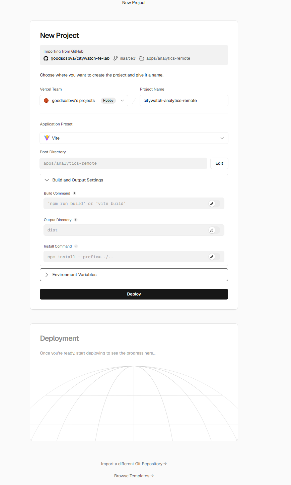
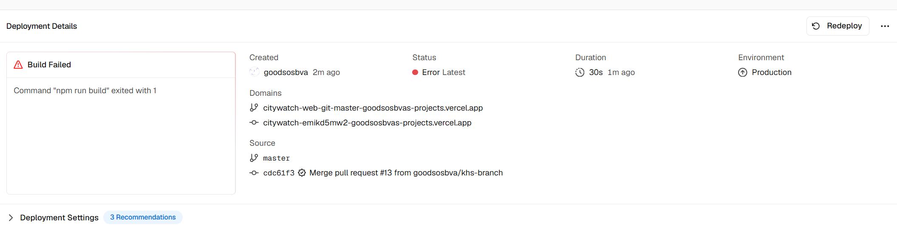
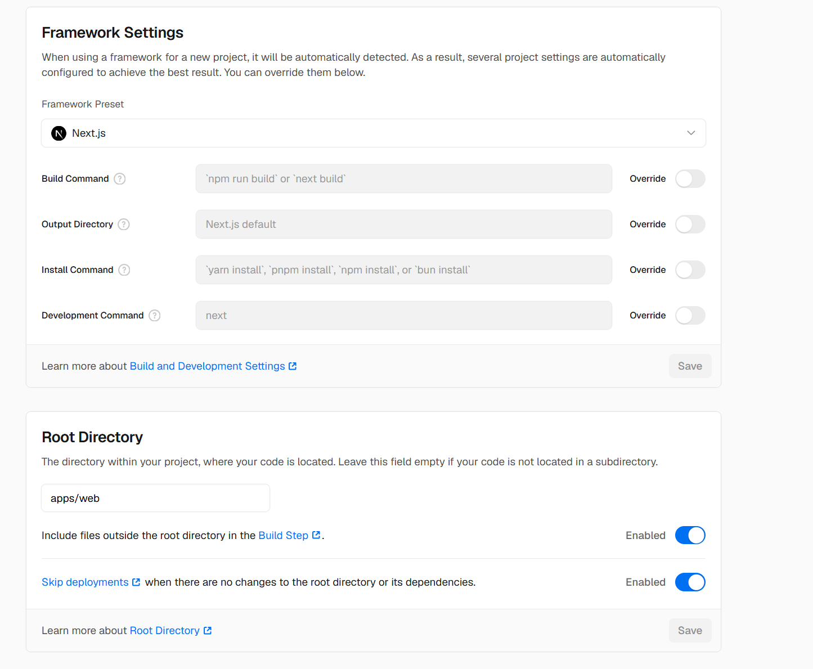
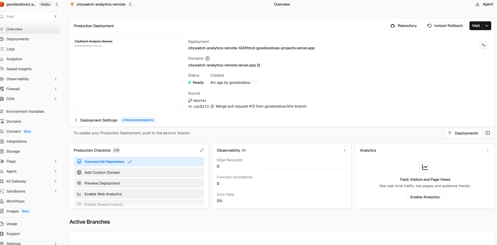

# [CityWatch 배포기 2/3] Vercel에 프론트엔드 배포하기

CityWatch의 프론트엔드는 두 개의 Vercel 프로젝트로 배포한다.

```text
apps/analytics-remote → Vite Remote
apps/web              → Next.js Host
```

Remote를 먼저 배포해야 Host가 Remote의 Manifest를 읽을 수 있다.

## 1. Analytics Remote 배포

Vercel에서 다음을 선택한다.

```text
Add New... → Project → goodsosbva/citywatch-fe-lab
```



입력값:

| 항목 | 값 |
|---|---|
| Project Name | `citywatch-analytics-remote` |
| Application Preset | `Vite` |
| Root Directory | `apps/analytics-remote` |
| Build Command | `npm run build` |
| Output Directory | `dist` |
| Install Command | `npm install --prefix=../../` |

Root Directory를 지정하는 이유는 저장소 전체가 아니라 Remote 앱만 빌드하기 위해서다.

### Environment Variables

`Environment Variables`를 펼치고 다음 값을 추가한다.

```text
Name: VITE_ANALYTICS_REMOTE_ORIGIN
Value: https://citywatch-analytics-remote.vercel.app
```

`Production`, `Preview`를 선택한다.

이 값은 Remote 파일의 실제 Vercel 주소를 만들 때 사용된다.

그다음 `Deploy`를 누른다.

배포가 끝나면 다음 주소를 확인한다.

```text
https://citywatch-analytics-remote.vercel.app/mf-manifest.json
```

JSON이 표시되면 Remote 배포 성공이다.



## 2. Web Host 배포

Vercel에서 다시 다음을 선택한다.

```text
Add New... → Project → goodsosbva/citywatch-fe-lab
```

이번 프로젝트 이름은 다음과 같이 입력한다.

```text
citywatch-web
```

설정값:

| 항목 | 값 |
|---|---|
| Framework Preset | `Next.js` |
| Root Directory | `apps/web` |
| Build Command | `npm run build` |
| Output Directory | 기본값 |
| Install Command | `npm install --prefix=../../` |



`Include files outside the root directory in the Build Step`은 **Enabled**로 둔다. `apps/web`이 루트 밖의 workspace 패키지를 사용하기 때문이다.

## 3. Web 환경변수 입력

`Environment Variables`를 펼치고 다음 3개를 추가한다.

```text
NEXT_PUBLIC_ANALYTICS_REMOTE_URL
https://citywatch-analytics-remote.vercel.app/mf-manifest.json
```

```text
NEXT_PUBLIC_REALTIME_POLL_URL
https://citywatch-realtime.onrender.com/events
```

```text
NEXT_PUBLIC_REALTIME_WS_URL
wss://citywatch-realtime.onrender.com/ws
```

각 변수에 `Production`, `Preview`를 선택한다.

주소의 역할은 다음과 같다.

| 변수 | 역할 |
|---|---|
| `NEXT_PUBLIC_ANALYTICS_REMOTE_URL` | Vercel Remote 연결 |
| `NEXT_PUBLIC_REALTIME_POLL_URL` | Render 이벤트 조회 |
| `NEXT_PUBLIC_REALTIME_WS_URL` | Render WebSocket 연결 |

로컬 주소인 `127.0.0.1`을 운영 환경변수에 넣으면 안 된다. 방문자의 컴퓨터를 가리키기 때문이다.

## 4. 배포 오류 수정

다음 화면이 나오면 Build Command가 실패한 것이다.



```text
Command "npm run build" exited with 1
```

다음 설정을 확인한다.

```text
Framework: Next.js
Root Directory: apps/web
Build Command: npm run build
Install Command: npm install --prefix=../../
Include files outside root: Enabled
```

설정 저장 후 다음 순서로 다시 배포한다.

```text
Deployments → 실패한 배포 → Redeploy
```

정확한 오류를 확인하려면 `Build Logs`에서 첫 번째 `Error:`를 확인한다. `Command exited with 1`은 실패 결과만 보여주는 메시지다.

## 5. 최종 확인

Remote:

```text
https://citywatch-analytics-remote.vercel.app/mf-manifest.json
```

Render:

```text
https://citywatch-realtime.onrender.com/health
```

Host:

```text
https://citywatch-web.vercel.app
```

Host 화면에서 Remote와 Realtime 기능이 모두 동작하면 Vercel 배포가 끝난다.
